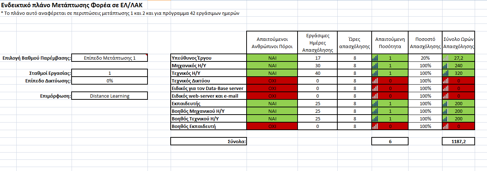
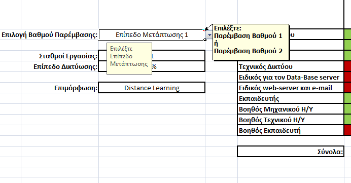
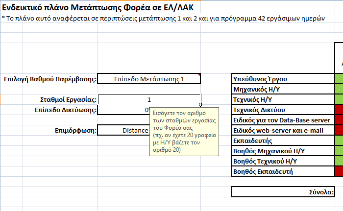
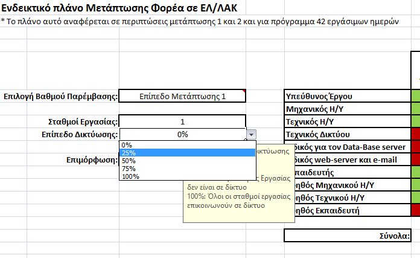
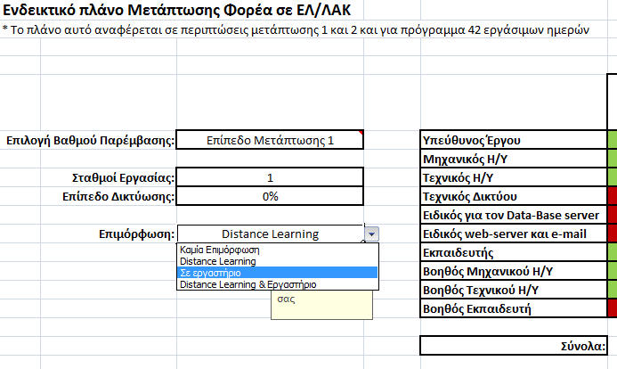

ToolKit - Οδηγός Μετάβασης στο Ανοιχτό Λογισμικό
================================================

1. Εισαγωγή
===========

Ο οδηγός αυτός έχει σκοπό να αποτελέσει ένα εργαλείο για την υιοθέτηση
των νέων τεχνολογιών ανοιχτού λογισμικού ή λογισμικού ανοιχτού κώδικα
(ΕΛ/ΛΑΚ) από κάθε ιδιωτικό ή δημόσιο Φορέα. Ειδικότερα, αναλύεται η
έννοια του ανοιχτού λογισμικού καθώς και τα πλεονεκτήματά του σε σχέση
με το αντίστοιχο κλειστό/εμπορικό λογισμικό∙ πλεονεκτήματα που δεν έχουν
να κάνουν μόνο με το μειωμένο κόστος αλλά και με τη διασπορά
τεχνογνωσίας, προσαρμογής λογισμικού στις ανάγκες του εκάστοτε χρήστη
κλπ. Στόχος λοιπόν του οδηγού αυτού είναι να καταδείξει ότι η χρήση
ΕΛ/ΛΑΚ είναι πλέον η διεθνής τάση τόσο για τις επιχειρήσεις όσο και για
τους κρατικούς οργανισμούς μιας και πλέον υπάρχει μια ανεπτυγμένη
κοινότητα ικανή να υποστηρίξει την επιλογή αυτή. Για την ισχυροποίηση
αυτών των επιχειρημάτων γίνεται και μία μικρή παρουσίαση πετυχημένων
πρακτικών (*best practices*) από οργανισμούς εντός και εκτός Ελλάδας.

Είναι σημαντικό να τονιστεί ότι με την υιοθέτηση του Συμφώνου Εταιρικής
Σχέσης (νέο ΕΣΠΑ, 2014-2020) και την ανάγκη τόνωσης της
ανταγωνιστικότητας, προτάσσεται η ανάγκη περαιτέρω προώθησης και
βελτίωσης της πρόσβασης σε τεχνολογίες Πληροφορικής και Επικοινωνιών
(ΤΠΕ) για όλο το φάσμα της ελληνικής οικονομίας. Οι δράσεις αυτές
προωθούνται μιας και έχουν πολλαπλά θετικά αποτελέσματα στην αλυσίδα
αξίας της εκάστοτε επιχείρησης, συμβάλλοντας στην κερδοφορία και την
ανάπτυξή της. Αντίστοιχα, η χρήση και η εφαρμογή των νέων τεχνολογιών
της πληροφορικής βοηθά και τη Δημόσια Διοίκηση στο πλαίσιο της
υιοθέτησης του Νέου Δημοσίου Management (*New Public Management*) στη
νέα σχέση της με τους πολίτες.

Στη συνέχεια ακολουθεί η ανάλυση του τρόπου με τον οποίο ένας υπάρχον
Φορέας μπορεί να μεταβεί αποτελεσματικά σε περιβάλλον ΕΛ/ΛΑΚ. Όπως κάθε
έργο, έτσι και το έργο της Μετάπτωσης σε ΕΛ/ΛΑΚ ακολουθεί κάποια στάδια
με σημαντικότερα τα στάδια του προγραμματισμού, της εκπαίδευσης και του
ελέγχου που θα καθορίσει και την τελική επιτυχία ή αποτυχία του. Το έργο
αυτό μπορεί να εκτελεστεί είτε από τον ίδιο τον Φορέα (*in-house*) είτε
εκτός του (*outsourcing*) με τη βοήθεια κάποιου ειδικευμένου Φορέα σε
ζητήματα ελεύθερου λογισμικού.

Τέλος, ο οδηγός αυτός, παρέχει μία εφαρμογή για την περαιτέρω βοήθεια
στο στάδιο του προγραμματισμού του εκάστοτε Φορέα ως προς το χρόνο και
το κόστος (σε ανθρωποώρες) που θα απαιτηθούν για τη μετάπτωση.

1.1 Στρατηγική Επιλογή στις Τεχνολογίες της Πληροφορίας και της Επικοινωνίας (ΤΠΕ)
----------------------------------------------------------------------------------

Κατά τη νέα περίοδο (2014-2020) η στρατηγική επιλογή σε ότι αφορά την
υλοποίηση έργων και την παροχή υπηρεσιών σε Τεχνολογίες Πληροφορίας και
Επικοινωνίας (ΤΠΕ), η οποία συμβαδίζει με τις εθνικές αναπτυξιακές
ανάγκες, είναι η ανάπτυξη λύσεων βασισμένων σε Ελεύθερο Λογισμικό /
Λογισμικό Ανοικτού Κώδικα  (ΕΛ/ΛΑΚ - Open Source). Οι λόγοι που
συνηγορούν σε αυτή την επιλογή συνοψίζονται ακολούθως:

-   **Ελαχιστοποίηση του κόστους** αδειών χρήσης που απαιτείται για την
    υλοποίηση έργων και στην παροχή υπηρεσιών ΤΠΕ, βελτιώνοντας το
    εμπορικό ισοζύγιο.

-   Με δεδομένο ότι το 80%-90% των απαιτούμενων λογισμικών είναι έτοιμο,
    **μειώνεται ο κίνδυνος (*risk*)** που καλείται να αναλάβει ο χρήστης
    μιας και, με πολύ μικρότερη δέσμευση πόρων, του παρέχεται η
    δυνατότητα δημιουργίας μιας πρωτότυπης και πλήρως
    λειτουργικής εφαρμογής.

-   **Τόνωση της απασχόλησης** στο χώρο των ΤΠΕ μειώνοντας την ανεργία
    και ειδικότερα αυτή των νέων επιστημόνων.

-   **Προσέλκυση επιστημόνων** υψηλής εξειδίκευσης δημιουργώντας
    προϋποθέσεις αναστροφής της διαφυγής στο εξωτερικό εξειδικευμένων
    στελεχών (του *brain drain*).

-   **Αύξηση της εγχώριας τεχνογνωσίας** και παράλληλα δημιουργία
    επιστημονικής κοινότητας με ικανότητα για παροχή υπηρεσιών σε
    διεθνές επίπεδο, βελτιώνοντας την ανταγωνιστικότητα.

-   Υλοποίηση έργων και παροχή υπηρεσιών ΤΠΕ υψηλής ποιότητας και
    προστιθέμενης αξίας, με χαμηλό κόστος ιδιοκτησίας και χρήσης,
    **χωρίς εγκλωβισμό** σε έναν προμηθευτή. Με αυτό τον τρόπο
    δημιουργούνται προϋποθέσεις για ανάπτυξη με ισχυρό πολλαπλασιαστή
    και των υπόλοιπων θεματικών στόχων και την έξοδο από την κρίση.

-   Γνωρίζοντας τη φύση του ΕΛ/ΛΑΚ ως «κοινωνικού» αγαθού, με την έννοια
    ότι ο κάθε χρήστης του οφείλει να φροντίζει για τη διαθεσιμότητα και
    την ποιότητά του για τους υπόλοιπους χρήστες, η υιοθέτηση του θα
    συμβάλλει στην περεταίρω ανάπτυξη και χρησιμότητα του.

Παράλληλα, δεν πρέπει να παραβλέπεται το γεγονός ότι η ανάπτυξη σε
ΕΛ/ΛΑΚ αποτελεί ήδη στρατηγική επιλογή για το λογισμικό των Υπηρεσιών
της Ευρωπαϊκής Επιτροπής.

1.2 ΕΛ/ΛΑΚ και Θεματικοί Στόχοι 2014-2020
-----------------------------------------

Οι **κύριες αναπτυξιακές ανάγκες** που καλείται να καλύψει η Ελλάδα κατά
την προγραμματική περίοδο 2014-2020 και μέσω του Συμφώνου Εταιρικής
Σχέσης 2014-2020, από τούδε και στο εξής αναφερόμενο ως «Εταιρικό
Σύμφωνο για το Πλαίσιο Ανάπτυξης (ΕΣΠΑ[^1]), **αναπτύσσονται σε 11
Θεματικούς Στόχους**:

-   **ΘΣ 1:** Ενίσχυση της Έρευνας, της Τεχνολογικής Ανάπτυξης και
    της Καινοτομίας.

-   **ΘΣ 2: Βελτίωση της πρόσβασης σε Τεχνολογίες Πληροφορικής και
    Επικοινωνιών (ΤΠΕ), της χρήσης και της ποιότητάς τους.**

-   **ΘΣ 3:** Βελτίωση της ανταγωνιστικότητας των μικρομεσαίων
    επιχειρήσεων συμπεριλαμβανομένων και αυτών του γεωργικού τομέα και
    του τομέα της αλιείας και της υδατοκαλλιέργειας.

-   **ΘΣ 4:** Υποστήριξη της μετάβασης σε μια οικονομία χαμηλών εκπομπών
    διοξειδίου του άνθρακα σε όλους τους τομείς.

-   **ΘΣ 5:** Προώθηση της προσαρμογής στην κλιματική αλλαγή και της
    πρόληψης των κινδύνων.

-   **ΘΣ 6:** Διατήρηση και προστασία του περιβάλλοντος και προώθηση της
    αποδοτικής χρήσης των πόρων.

-   **ΘΣ 7:** Προώθηση των βιώσιμων μεταφορών και άρση των εμποδίων σε
    βασικές υποδομές δικτύων.

-   **ΘΣ 8:** Προώθηση της βιώσιμης και ποιοτικής απασχόλησης και
    υποστήριξη της κινητικότητας των εργαζομένων.

-   **ΘΣ 9:** Προώθηση της κοινωνικής ένταξης και της καταπολέμησης της
    φτώχειας και κάθε διάκρισης.

-   **ΘΣ 10:** Επένδυση στην εκπαίδευση και κατάρτιση για την απόκτηση
    δεξιοτήτων και στη δια βίου μάθηση.

-   **ΘΣ 11:** Ενίσχυση της θεσμικής ικανότητας των δημόσιων υπηρεσιών
    και των φορέων, καθώς και της αποτελεσματικής δημόσιας διοίκησης.

Ο Θεματικός Στόχος 2 «Βελτίωση της πρόσβασης σε ΤΠΕ, της χρήσης και της
ποιότητάς τους» αποτελεί ίσως τον πιο οριζόντιο στόχο σε σχέση με το
σύνολο των υπολοίπων του Συμφώνου Εταιρικής Σχέσης (νέο ΕΣΠΑ). Είναι
δηλαδή ο Στόχος ο οποίος, σε μεγάλο βαθμό, προαπαιτείται από όλους και η
επίτευξη του, τροφοδοτεί όλους τους άλλους Θεματικούς Στόχους.

Για το λόγο αυτό, η στρατηγική επιλογή ανάπτυξης λύσεων βασισμένων σε
Ελεύθερο Λογισμικό / Λογισμικό Ανοικτού Κώδικα  (ΕΛ/ΛΑΚ) **αναμένεται να
διατρέχει οριζόντια το σύνολο των απαιτήσεων των Θεματικών Στόχων** για
έργα και υπηρεσίες ΤΠΕ, καλύπτοντας και τους υπόλοιπους 10 Θεματικούς
Στόχους του Επιχειρησιακού Προγράμματος «Ανταγωνιστικότητα,
Επιχειρηματικότητα και Καινοτομία (ΕΠΑνΕΚ) του Συμφώνου Εταιρικής Σχέσης
(νέο ΕΣΠΑ) για την περίοδο 2014-2020.

2. Ελεύθερο Λογισμικό / Λογισμικό Ανοιχτού Κώδικα (ΕΛ/ΛΑΚ)
==========================================================

2.1 Τί είναι το Ελεύθερο Λογισμικό / Λογισμικό Ανοιχτού Κώδικα (ΕΛ/ΛΑΚ);
------------------------------------------------------------------------

Με τον όρο Ελεύθερο Λογισμικό / Λογισμικό Ανοικτού Κώδικα (ΕΛ/ΛΑΚ -
FLOSS Free/Libre - Open Source Software), εννοούμε λογισμικό και
εφαρμογές που διατίθενται ελεύθερα είτε για επαγγελματική είτε για
προσωπική χρήση και ταυτόχρονα παρέχουν στους χρήστες τους όχι μόνο τον
πηγαίο κώδικα αλλά και την άδεια να τον μελετήσουν, να τον τροποποιήσουν
και να τον αναδιανείμουν[^2]. Είναι σημαντικό να διευκρινιστεί ότι ο
όρος «ελεύθερο» αναφέρεται στην ελευθερία του χρήστη να χρησιμοποιήσει,
να αντιγράψει, να διανείμει, να μελετήσει, να αλλάξει και να βελτιώσει
το λογισμικό αυτό. Αναλυτικότερα έχουμε:

-   Ελευθερία χρήσης ΕΛ/ΛΑΚ για προσωπική ή επαγγελματική χρήση.

-   Ελευθερία αναδιανομής αντιγράφων του ΕΛ/ΛΑΚ.

-   Ελευθερία μελέτης ΕΛ/ΛΑΚ και προσαρμογής τους στις προσωποποιημένες
    ανάγκες του κάθε χρήστη μέσω της πρόσβασης στον πηγαίο κώδικα.

-   Ελευθερία βελτίωσης του ΕΛ/ΛΑΚ και διάθεσής του πηγαίου κώδικα στο
    ευρύ κοινό.

Μέσω, λοιπόν, της συλλογικής δράσης, από όλο τον κόσμο, εθελοντών
προγραμματιστών και προγραμματιστών που διατίθεται από εταιρίες που
υποστηρίζουν το ΕΛ/ΛΑΚ, έχουν αναπτυχθεί, τα τελευταία 40 χρόνια, μεγάλα
και επιτυχημένα λογισμικά που χρησιμοποιούνται, τόσο σε επαγγελματικές
εφαρμογές όσο και για προσωπική χρήση. Οι πιο γνωστές εφαρμογές ΕΛ/ΛΑΚ
αφορούν λειτουργικά συστήματα Η/Υ, συστήματα διαχείρισης βάσεων
δεδομένων, διακομιστές, γλώσσες προγραμματισμού και πλατφόρμες
τηλεκπαίδευσης. Η επίδραση και η διάδοση του ελεύθερου λογισμικού είναι
τέτοια που μεγάλες εταιρίες πληροφορικής (πχ ΙΒΜ) αλλάζουν τη φύση της
λειτουργίας τους και αντί να πουλάνε (κλειστό) λογισμικό παρέχουν
υπηρεσίες υποστήριξης ανοιχτού λογισμικού.

2.2 Μετάπτωση σε Ελεύθερο Λογισμικό / Λογισμικό Ανοιχτού Κώδικα (ΕΛ/ΛΑΚ)
------------------------------------------------------------------------

Σε ιδεατές συνθήκες, η βέλτιστη επιλογή θα ήταν η υιοθέτηση
Ελεύθερου/Ανοιχτού Λογισμικού από την πρώτη ίδρυση ή οργάνωση ενός Φορέα
(επιχείρησης/οργανισμού). Ο κύριος όμως όγκος των υπαρχόντων Φορέων
χρησιμοποιεί ήδη κλειστά/εμπορικά συστήματα τόσο στην οργάνωσή των
υπολογιστικών τους υποδομών όσο στις εφαρμογές τους. Βασικός στόχος του
οδηγού αυτού αποτελεί η λεπτομερής περιγραφή των διαδικασιών που
απαιτούνται για το σχεδιασμό ενός έργου μετάπτωσης από κλειστό σε
ανοιχτό περιβάλλον.

### 2.2.1 Πλεονεκτήματα ΕΛ/ΛΑΚ

Συνοπτικά, τα πλεονεκτήματα χρήσης ελεύθερου λογισμικού είναι:

-   Μικρότερο κόστος απόκτησης του σε σχέση με τα αντίστοιχα
    κλειστά/εμπορικά λογισμικά. Το κόστους κτήσης και χρήσης είναι
    μηδενικό ενώ η προσεκτική επιλογή του κατάλληλου software
    ελαχιστοποιεί τις ανάγκες επανεκπαίδευσης του προσωπικού.

-   Δυνατότητα εγκατάστασης και χρήσης του σε απεριόριστο αριθμό σταθμών
    εργασίας χωρίς την απαίτηση αγοράς νέων αδειών. Το κόστος αυτό είναι
    ιδιαίτερα σημαντικό και δεν συνάδει πάντα με τις πραγματικές ανάγκες
    του εκάστοτε Φορέα (αστοχίες προγραμματισμού/προϋπολογισμού αγοράς
    αδειών οδηγούν σε ενδεχόμενες ελλείψεις ή πλεονάσματα αδειών).

-   Αποδέσμευση από συγκεκριμένες εταιρίες ως προς την προμήθεια ή την
    αναβάθμιση του λογισμικού.

-   Δυνατότητα προσαρμογής του λογισμικού στις προσωποποιημένες ανάγκες
    του κάθε χρήστη.

-   Δυνατότητα χρήσης μοντέλων υπολογιστών παλαιότερης σχετικά
    τεχνολογίας που δεν μπορούσαν να λειτουργήσουν στο διαρκώς
    εξελισσόμενο περιβάλλον του κλειστού λογισμικού ενώ μέσω των
    προσωποποιημένων αναγκών που μπορεί να καλύψει το ΕΛ/ΛΑΚ τους
    δίνεται μια παράταση στον ωφέλιμο χρόνο ζωής τους.

-   Σχεδόν πλήρης υποκαταστασιμότητα του ΕΛ/ΛΑΚ με τα αντίστοιχα
    κλειστά/εμπορικά λογισμικά[^3].

### 2.2.2 Προβλήματα ΕΛ/ΛΑΚ

Παρά τα σημαντικά πλεονεκτήματα της χρήσης ΕΛ/ΛΑΚ, δεν λείπουν και τα
προβλήματα κυρίως στη φάση της λειτουργίας και της εξέλιξής τους:

-   Μπορεί το αρχικό κόστος εγκατάστασης ενός ΕΛ/ΛΑΚ να είναι μηδενικό,
    αυτό όμως δε σημαίνει ότι δεν πρέπει να συντηρείται ή
    να διορθώνεται. Υπάρχει λοιπόν η ανάγκη για εξειδικευμένα στελέχη σε
    ΕΛ/ΛΑΚ για συνεχή παραμετροποίηση και υποστήριξη του Φορέα
    υιοθέτησης του. Αυτό δημιουργεί κόστος πέρα από την εγκατάσταση αλλά
    και στη λειτουργία του ανοιχτού λογισμικού.

-   Βασικό επίσης ζήτημα στην υιοθέτηση ΕΛ/ΛΑΚ είναι το κόστος
    εκπαίδευσης και επανεκπαίδευσης του προσωπικού στο νέο περιβάλλον.
    Ανάλογα με το μέγεθος και το είδος του Φορέα, μάλιστα, μπορεί να
    καταστεί σημαντικό και δεν πρέπει να παραβλέπεται.

-   Έλλειψη ορισμένων εξειδικευμένων εφαρμογών και πιθανές ασυμβατότητες
    ΕΛ/ΛΑΚ με κάποια κλειστά πρότυπα αρχείων.

-   Ο αποκεντρωμένος συντονισμός αποτελεί το βασικό προσόν του ΕΛ/ΛΑΚ
    αλλά ταυτόχρονα και το βασικό του μειονέκτημα. Η απουσία
    ξεκάθαρης/κεντρικής στοχοθεσίας μπορεί να συντελεί στην πρόοδο αλλά
    μπορεί και να αποτελεί εμπόδιο σε αυτήν λόγω προσωπικών αγκυλώσεων
    ή συμφερόντων. Εξάλλου, η απουσία χρηματικού ανταλλάγματος άλλωστε
    πολλές φορές αποτελεί αντικίνητρο για την παραγωγή
    νέου/βελτιωμένου λογισμικού.

Για όλους τους παραπάνω λόγους, η ανάγκη της εκ των προτέρων μελέτης των
απαιτούμενων διαδικασιών και η προσπάθεια εκτίμησης των κινδύνων είναι
επιτακτική λόγω της απαίτησης για απρόσκοπτη λειτουργία του εκάστοτε
Φορέα. Μέσω του ορθού προγραμματισμού της οποιασδήποτε μετάβασης,
ελαχιστοποιούνται τα προβλήματα και μεγιστοποιούνται τα οφέλη αυτής της
μετάβασης.

Ο σωστός προγραμματισμός συνεπικουρεί στα οφέλη της μετάπτωσης στη νέα
φιλοσοφία του ΕΛ/ΛΑΚ, μιας μεταβολής που αλλάζει, σε μεγάλο βαθμό, τον
τρόπο καθημερινής λειτουργίας του εκάστοτε Φορέα και διαταράσσει την
υπάρχουσα παγιωμένη πρακτική του.

2.3 Σε ποιους απευθύνεται;
--------------------------

Το έργο της μετάπτωσης σε ΕΛ/ΛΑΚ απευθύνεται σε δύο κατηγορίες
ενδιαφερομένων, τόσο σε φορείς του **Δημοσίου** όσο και σε φορείς του
**Ιδιωτικού** τομέα. Και στις δύο κατηγορίες, απαραίτητη προϋπόθεση
αποτελεί η διαμόρφωση από τον εκάστοτε ενδιαφερόμενο, ενός
Επιχειρησιακού Σχεδίου που θα εξειδικεύει την υιοθέτηση ΕΛ/ΛΑΚ στην
αλυσίδα αξίας τους. Παράλληλα, θα περιλαμβάνει και σχέδιο μετάβασης σε
ΕΛ/ΛΑΚ τεκμηριώνοντας τη βιωσιμότητα της παρέμβασης.

Προβλέπονται τέσσερα είδη παρεμβάσεων που περιγράφονται ακολούθως,
ανάλογα με τη φύση και το αντικείμενο των εργασιών του εκάστοτε φορέα,
ενώ, είναι δυνατό, να επιλέγουν παρεμβάσεις από διαφορετικά επίπεδα
μετάπτωσης. Κοινό ζητούμενο στο οποίο θα πρέπει να επικεντρώνεται η
προετοιμασία των ενδιαφερόμενων είναι η **επιτυχημένη μετάπτωση** και η
**βιωσιμότητα της υιοθετούμενης λύσης/παρέμβασης**.

Στόχος είναι η υλοποίηση και εφαρμογή παρεμβάσεων σε ΕΛ/ΛΑΚ που
λειτουργούν παραγωγικά, τηρώντας **τις πρακτικές για εργασία σε ανοικτό
κώδικα** καθώς και τις **απαιτήσεις για ανοικτότητα,** όπως η
ενδεδειγμένη αδειοδότηση του παραγόμενου λογισμικού καθώς και η ανάρτηση
του σε δημόσιο αποθετήριο (GitHub ή αντίστοιχο).

2.4 Κριτήρια Επιλογής λογισμικών Ανοιχτού Κώδικα
------------------------------------------------

Ανάλογα με τη φύση και τον σκοπό του και πριν πάρει την τελική του
απόφαση για την επιλογή της έκτασης της μετάπτωσης σε ΕΛ/ΛΑΚ, ο εκάστοτε
Φορέας οφείλει να διερευνήσει μια σειρά από παράγοντες:

1.  Καταλληλότητα ως προς τις ανάγκες του Φορέα.

2.  Αριθμός σταθμών εργασίας.

3.  Εξοικείωσης ή προσαρμοστικότητας των χρηστών τους σε ΕΛ/ΛΑΚ.

4.  Άδεια χρήσης (Διαθέσιμες
    Άδειες-[*http://www.opensource.org/licenses*](http://www.opensource.org/licenses)),

5.  Ύπαρξη στελεχών που είναι σε θέση να αναλάβουν την υποστήριξη του
    λογισμικού εσωτερικά στο Φορέα ή εναλλακτικά η επιλογή εξωτερικών
    συνεργατών ή τοπικής εταιρείας πληροφορικής με τεχνογνωσία και
    εμπειρία στην υποστήριξη του επιλεγμένου λογισμικού.

2.5 Είδη Παρεμβάσεων
--------------------

Παρακάτω, περιγράφονται τα αντικείμενα τεσσάρων ειδών παρεμβάσεων με
ενδεικτικές εργασίες προσωπικού ΤΠΕ διαφόρων ειδικοτήτων και εμπειρίας.
Οι παρεμβάσεις αυτές χωρίζονται σε επίπεδα έντασης (Μετάπτωση Επιπέδου 1
ή 2 κλπ) ανάλογα με το βαθμό επιθυμητής παρέμβασης.

Τα είδη των παρεμβάσεων συνδέονται σχεδόν γραμμικά, με την έννοια ότι το
ένα επίπεδο μετάπτωσης οφείλει να ακολουθεί το άλλο. Για παράδειγμα, για
έναν οργανισμό χωρίς καμία εμπειρία σε ΕΛ/ΛΑΚ προτείνεται η επιλογή της
Μετάπτωσης Επιπέδου 1 (παρέμβαση *Front Office*) και στη συνέχεια η
μετάπτωση σε δεύτερο ή τρίτο επίπεδο (παρεμβάσεις Back Office και
ανάπτυξης λογισμικού). Τέλος, η παρέμβαση επιπέδου 4, που είναι και η
πλέον ανταποδοτική στην κοινότητα του ΕΛ/ΛΑΚ προτείνεται μόνο για Φορείς
με μεγάλη εμπειρία και τεχνογνωσία στη χρήση και διαμόρφωση ανοιχτού
λογισμικού.

### 2.5.1 Μετάπτωση Επιπέδου 1: Μετάβαση του λογισμικού σταθμών εργασίας. (Παρέμβαση *Front Office*)

Η μετάπτωση πρώτου επιπέδου (ή μετάπτωση *front office*) είναι η πρώτη
που οφείλει να υιοθετηθεί από έναν οργανισμό χωρίς καμία εμπειρία στη
χρήση ελεύθερου λογισμικού. Η διαδικασία μετάπτωσης αναφέρεται στα
τερματικά των χρηστών υπολογιστών του κάθε σταθμού εργασίας και απαιτεί
την εξοικείωση του ανθρώπινου δυναμικού του Φορέα μετάπτωσης στο νέο
«ανοιχτό» περιβάλλον. Αναλυτικότερα:

-   Περιλαμβάνονται εργασίες για την εγκατάσταση:

    -   Εφαρμογών λογισμικών γραφείου (πχ από Office σε LibreOffice) ή
        άλλων εφαρμογών γενικής χρήσης καθώς και

    -   λειτουργικών συστημάτων (πχ από Windows σε Ubuntu)

σε ΕΛ/ΛΑΚ[^4].

-   Περιλαμβάνεται επίσης ανθρωποπροσπάθεια για τη μετάπτωση:

    -   αρχείων (πχ. αρχεία κειμένου),

    -   τεχνοδιαμορφώσεων (*configurations*),

    -   λειτουργιών και

    -   μεθόδων εργασίας

στο νέο περιβάλλον λειτουργίας.

-   Τέλος, περιλαμβάνονται υπηρεσίες όπως:

    -   η υποστήριξη πιλοτικών εγκαταστάσεων,

    -   η κατάρτιση και η υποστήριξη τεχνικών (*helpdesk*) και των
        τελικών χρηστών,

    -   η διάχυση των νέων μεθόδων και των αλλαγών του τρόπου εργασίας
        και

    -   η δημιουργία ενός ξεχωριστού εργαστηρίου (*Learning Lab*) που θα
        αποτελεί τον χώρο δοκιμής και εκπαίδευσης το ελεύθερου
        λογισμικού του ΕΛ/ΛΑΚ.

Ειδικότερα, όσο αφορά στο
εργαστήριο, το βέλτιστο είναι η δημιουργία ενός ξεχωριστού χώρου με 4-5
τερματικά όπου εκεί θα «τρέχει» η πρώτη δοκιμαστική λειτουργία του νέου
λογισμικού και η προσομοίωση του περιβάλλοντος εργασίας σε ΕΛ/ΛΑΚ ώστε
να εντοπίζονται οι ανάγκες και τα ενδεχόμενα προβλήματα στη λειτουργία
του οργανισμού. Ουσιαστικά αποτελεί μία πιλοτική εγκατάσταση για δοκιμές
και εκπαίδευση σε πραγματικό χρόνο. Με τον τρόπο αυτό επιτυγχάνεται η
αποτελεσματικότερος προγραμματισμός και η καλύτερη εκτίμηση των κινδύνων
που ενδεχομένως να υπάρξουν μετά τη μετάπτωση. Το εργαστήριο αυτό θα
παραμείνει στον εκάστοτε φορέα (υπό την ευθύνη του Τεχνικού Η/Υ του
οργανισμού) και θα αποτελεί χώρος εκπαίδευσης και προσομοίωσης νέων
πληροφοριακών εφαρμογών και συστημάτων.

Τέλος, αξίζει να τονίσουμε το γεγονός ότι η μετάπτωση του πρώτου
επιπέδου, παρόλο που είναι η φαινομενικά απλούστερη, έχει τον μεγαλύτερο
αριθμό εμπλεκομένων μιας και οι χρήστες του τελικού αποτελέσματος θα
είναι σχεδόν όλοι οι εργαζόμενοι του Φορέα. Αυξάνονται λοιπόν οι
απαιτήσεις για κατάρτιση καθώς και οι κίνδυνοι ως προς την απρόσκοπτη
λειτουργία του Φορέα. Ο σχεδιασμός της μετάπτωσης συνεπώς, οφείλει να
είναι εξαιρετικά προσεκτικός.

### 2.5.2 Μετάπτωση Επιπέδου 2: Μετάπτωση Λογισμικού και Συστημάτων (Παρέμβαση *Back Office*)

Στο δεύτερο επίπεδο μετάπτωσης έχουμε την *Back Office* παρέμβαση η
οποία ακολουθεί τη μετάπτωση πρώτου επιπέδου. Πλέον οι παρεμβάσεις
προχωρούν βαθύτερα από τους σταθμούς εργασίας προς τα κεντρικά συστήματα
και τους εξυπηρετητές του οργανισμού. Ειδικότερα:

-   Περιλαμβάνονται εργασίες για την εγκατάσταση:

    -   λογισμικών λειτουργικών συστημάτων υπολογιστών και εξυπηρετητών
        διαδικτύου,

    -   συστημάτων βάσεων και αποθηκών δεδομένων,

    -   κεντρικοποιημένων εφαρμογών (π.χ. Εφαρμογές Λογιστηρίου,
        Διαχείρισης προσωπικού, ERP, CRM κλπ.)

    -   συστημάτων διαδικτυακών υπηρεσιών, ελέγχου πρόσβασης και
        διαχείρισης χρηστών καθώς και

    -   εργαλείων διαχείρισης, εποπτείας και ελέγχου των υπολογιστικών
        υποδομών

σε ΕΛ/ΛΑΚ.

-   Περιλαμβάνεται επίσης ανθρωποπροσπάθεια για:

    -   τη μετάπτωση αρχείων και βάσεων δεδομένων,

    -   τεχνοδιαμορφώσεων (*configurations*),

    -   λειτουργιών και

    -   διαδικασιών

στο νέο περιβάλλον λειτουργίας.

-   Απαιτείται επίσης ανθρωποπροσπάθεια για την προσαρμογή συστημάτων
    και εφαρμογών που έχουν υλοποιηθεί από τρίτους.

-   Τέλος, σε κάθε περίπτωση, για την επιτυχημένη διαχείριση της
    μετάβασης είναι απαραίτητο να διασφαλιστεί:

    -   η υποστήριξη πιλοτικών εγκαταστάσεων,

    -   η ύπαρξη απαραίτητων τεχνικών κλιμακίων διαχειριστών του
        ενδιαφερομένου για τη συντήρηση των νέων εργαλείων

    -   η κατάρτιση και η υποστήριξη τεχνικών κλιμακίων του
        ενδιαφερομένου στα νέα εργαλεία και μεθόδους, καθώς και στις
        αλλαγές στον τρόπο εργασίας και

    -   η διαλειτουργικότητα με τα υπόλοιπα συστήματα.

Και σε αυτό το επίπεδο μετάπτωσης, το εργαστήριο (*Learning Lab*) θα
είναι ο καταλληλότερος χώρος για την προσομοίωση του νέου περιβάλλοντος
που θα διασφαλίσει τη διαλειτουργικότητα με τα υπόλοιπα συστήματα του
οργανισμού.

### 2.5.3 Μετάπτωση Επιπέδου 3: Αξιοποίηση εργαλείων και μεθόδων ΕΛ/ΛΑΚ στην ανάπτυξη Λογισμικού και Συστημάτων και την παροχή νέων υπηρεσιών.

Στο τρίτο επίπεδο μετάπτωσης ο οργανισμός προχωρά πέρα από την χρήση ή
προσαρμογή του ΕΛ/ΛΑΚ στη δημιουργία και ανάπτυξη του ανάλογου
λογισμικού και στην παροχή υποστηρικτικών υπηρεσιών. Στο πλαίσιο των
παρεμβάσεων αυτών (που απαιτούν την πλήρη υιοθέτηση και λειτουργία των
επιπέδων 1 και 2) περιλαμβάνονται εργασίες καθ’ όλη τη διάρκεια του
κύκλου ζωής των συστημάτων που βασίζονται σε τεχνολογίες ΕΛ/ΛΑΚ.

Στο πλαίσιο της παρέμβασης του τρίτου σταδίου έχουμε τις ακόλουθες
ενέργειες:

-   Ανθρωποπροσπάθεια για:

    -   το σχεδιασμό λειτουργικών προδιαγραφών,

    -   τη δοκιμαστική λειτουργία

    -   την εκπαίδευση και

    -   την παραγωγική λειτουργία.

-   Σε κάθε περίπτωση για την επιτυχημένη διαχείριση της μετάβασης είναι
    απαραίτητο να διασφαλιστεί:

    -   Η υποστήριξη πιλοτικών εγκαταστάσεων (όπου απαιτείται),

    -   η ύπαρξη απαραίτητων τεχνικών κλιμακίων διαχειριστών και
        προγραμματιστών του δικαιούχου για τη συντήρηση των νέων
        εργαλείων και

    -   η κατάρτιση και η υποστήριξη τεχνικών κλιμακίων και χρηστών του
        φορέα στα νέα εργαλεία και στις αλλαγές στον τρόπο εργασίας.

Η ανάπτυξη του λογισμικού και των συστημάτων θα πρέπει να γίνεται
σύμφωνα με τις πρακτικές εργασίας σε ανοικτό κώδικα και το λογισμικό που
θα παραδίδεται (σε παραγωγική λειτουργία) θα παρέχει και την
ενδεδειγμένη αδειοδότηση.

Οι ενέργειες που θα γίνουν για τη μετατροπή του οργανισμού από απλό
χρήστη σε φορέα ανάπτυξης ΕΛ/ΛΑΚ είναι πλέον πιο στοχευμένες και
αναφέρονται στο ειδικευμένο προσωπικό του. Ουσιαστικά το Learning Lab
των προηγούμενων δύο σταδίων μετατρέπεται σε ένα εργαστήριο Έρευνας και
Ανάπτυξης που καλούμενο να ανταπεξέλθει στις λειτουργικές ανάγκες του
Φορέα αναπτύσσει νέες εξατομικευμένες εφαρμογές. Παράλληλα, το νέο
ΕΛ/ΛΑΚ θα είναι αναρτημένο σε δημόσιο αποθετήριο (πχ GitHub ή
αντίστοιχο).

### 2.5.4 Μετάπτωση Επιπέδου 4: Αξιοποίηση διαδικτυακών εργαλείων ΕΛ/ΛΑΚ για την ενεργό συμμετοχή, τη διάχυση περιεχομένου, παροχή υπηρεσιών crowdsourcing και συνεργασία ομάδων εργασίας και κοινοτήτων.

Η πλέον φιλόδοξη από τις παρεμβάσεις είναι η μετάπτωση επιπέδου 4 όπου ο
Φορέας όχι απλά έχει υιοθετήσει, στην καθημερινή του δράση, τις
πρακτικές του ελεύθερου λογισμικού αλλά και συμβάλλει στη διάδοσή και
διάχυσή τους μέσω περιεχομένου, υπηρεσιών και διαδικασιών πληθοπορισμού.
Στο πλαίσιο την παρέμβασης αυτής περιλαμβάνονται:

-   Ανθρωποπροσπάθεια για τη βελτίωση και ανάπτυξη υπηρεσιών που παρέχει
    ο Φορέας σχετικά με:

    -   Προγραμματιστικές διεπαφές δεδομένων,

    -   Σχεδιασμό

    -   Εμπλοκή και κινητοποίηση για την παραπέρα βελτίωση ή ανάπτυξη
        νέων εφαρμογών γύρω από της υπηρεσίες που παρέχει ο Φορέας.

    -   Κινητοποίηση εργαζομένων και χρηστών των υπηρεσιών του.

    -   Υπηρεσίες περιεχομένου και τη δημιουργία νέων υπηρεσιών.

-   Επιπροσθέτως, είναι δυνατό να απαιτηθεί η συγκρότηση συστημάτων
    υπηρεσιών πληθοπορισμού (crowdsourcing) για διάφορους σκοπούς όπως:

    -   Ο έλεγχος των εφαρμογών,

    -   η τεκμηρίωση περιεχομένου,

    -   η υποστήριξη,

    -   η κατάρτιση,

    -   οι ψηφιακές συλλογές κλπ.

Βασικός στόχος των οργανισμών των Φορέων που επιλέγουν την μετάπτωση του
επιπέδου 4 είναι η διάδοση και η διάχυση των νέων μεθόδων και αλλαγών
στον τρόπο εργασίας. Προκειμένου να επιτευχθεί κάτι τέτοιο απαιτείται
σωστός σχεδιασμός και υποστήριξη από τα αρμόδια τμήματα τους και η
στελέχωσή τους με καταρτισμένο προσωπικό. Πλέον, ο οργανισμός μεταβαίνει
από τα στάδια του χρήστη (επίπεδο 1 ή 2) ή παραγωγού ΕΛ/ΛΑΚ (επίπεδο 3)
σε φορέα μετάπτωσης και διάχυσης των πρακτικών μιας νέας περισσότερο
συμμετοχικής και εξωστρεφούς δράσης. Στην ουσία, η «μετάπτωση επιπέδου
4» και η προηγούμενη («μετάπτωση επιπέδου 3») δεν αναφέρονται στη
συμβατική μετάπτωση σε ΕΛ/ΛΑΚ αλλά στο μετασχηματισμό όλης της δομής και
της αντιμετώπισης του ανοιχτού λογισμικού.

2.6 Επιτυχημένα Παραδείγματα – Best Practices
---------------------------------------------

Η αναφορά σε βέλτιστες πρακτικές είναι σημαντική για την ανάπτυξη και
προώθηση του ελεύθερου και ανοικτού λογισμικού (ΕΛ/ΛΑΚ). Το ανοικτό
λογισμικό είναι ένας κοινόχρηστος πόρος που για να παραμένει
επικαιροποιημένος και χρήσιμος για όλους θα πρέπει να ενισχύεται,
αναλογικά, από κάθε χρήστη και ειδικά από τους Φορείς που επωφελούνται
από τη χρήση του. Αντίστοιχα, αξιοποιώντας την εμπειρία προηγούμενων
προσπαθειών μετάπτωσης σε ανοιχτό λογισμικό, έχουμε την ευχέρεια να
αποφύγουμε λάθη που έγιναν σε προγενέστερα εγχειρήματα και να
παραδειγματιστούμε τόσο από τη διαδικασία μετάβασης, όσο και από τη
διαδικασία προσαρμογής και υιοθέτησής τους.

### 2.6.1 Γαλλική Δημόσια Διοίκηση

Το μεγαλύτερο εγχείρημα χρήσης ΕΛ/ΛΑΚ στην Ευρώπη υλοποιήθηκε από το
Γαλλικό Υπουργείο Εσωτερικών σε περίπου 240.000 προσωπικούς υπολογιστές.
Αντίστοιχα, πολλά υπουργεία της Γαλλικής Δημοκρατίας χρησιμοποιούν
εφαρμογές ανοιχτού κώδικα, όπως το LibreOffice, συμπεριλαμβανομένων των
Υπουργείων Οικονομικών, Εξωτερικών και των Φορολογικών Αρχών.

Η Γαλλική Αστυνομία μάλιστα (*Gendarmerie nationale),* μέχρι το 2014,
είχε τοποθετήσει σε 72.000 σταθμούς εργασίας της το λογισμικό Ubuntu
Linux (version 12.04). Όπως υποστηρίζεται, μέσω του ΕΛ/ΛΑΚ, δίνεται η
δυνατότητα στη Διοίκηση να επεξεργάζεται και να βελτιώνει τους κώδικές
αυτούς και ταυτόχρονα να απολαμβάνει τους καρπούς της συνεργασίας μιας
παγκόσμιας διαδικτυακής κοινότητας. Επιπρόσθετα, το ανοιχτό λογισμικό
επιτρέπει στις Εθνικές Διοικήσεις, πέρα από το να περιορίζουν το κόστους
λειτουργίας τους, να ελέγχουν και τη διάχυση της πληροφόρησης προς
Υπηρεσίες Πληροφοριών τρίτων χωρών αφού συμμετέχουν ενεργά στις
διαμόρφωση του λογισμικού τους και δεν εξαρτώνται από ένα κλειστό και
άγνωστο λογισμικό τρίτων. Όπως χαρακτηριστικά αναφέρθηκε από τους
Γάλλους επιτελείς, «τα συστήματα ΕΛ/ΛΑΚ δίνουν την ευχαίρεια καλύτερου
εσωτερικού ελέγχου και προστασίας σε όλη τη διάρκεια ζωής των Η/Υ».

Η Γαλλική Αστυνομία ξεκίνησε τη μετάπτωση προς το ΕΛ/ΛΑΚ πριν περίπου 12
χρόνια με την αντικατάσταση σε 90.000 σταθμούς εργασίας του ευρέως
διαδεδομένου Microsoft Office με το αντίστοιχο λογισμικό ανοιχτού κώδικα
OpenOffice. Το 2006 συνέχισε στην υιοθέτηση του Mozilla Firefox για
πλοήγηση στο διαδίκτυο και του Mozilla Thunderbird για το e-mail. Το
2008 έγινε και η πρώτη πλήρης μετάπτωση 5.000 θέσεων εργασίας σε χρήση
ανοιχτού λογισμικού με τη χρήση Ubuntu Linux. Τα αποτελέσματα ήταν
θεαματικά μιας και χάρη στη μετάπτωση, μειώθηκε το κόστος του κάθε
σταθμού εργασίας κατά 40%[^5].

### 2.6.2 Η πόλη του Μονάχου

Αυτό που διαφοροποιεί την πόλη του Μονάχου από τους υπόλοιπους Φορείς
που κάνουν χρήση του Ελεύθερου/Ανοιχτού Λογισμικού είναι ότι αποτελεί
έναν από τους πλέον σημαντικούς συντελεστές σε αρκετά έργα ΕΛ/ΛΑΚ. Οι
διορθώσεις σε σφάλματα κώδικα (bugfixes) των εφαρμογών χρησιμοποιεί, η
δημοσίευση λύσεων λογισμικού και η ανταλλαγή βέλτιστων πρακτικών και
τεχνικών πληροφοριών, καθιστούν την πόλη του Μονάχου έναν σημαντικό
συντελεστή στο χώρο του ανοικτού λογισμικού και παράδειγμα καλής
πρακτικής χρήσης EΛ/ΛAK**.**

Η πόλη συνδυάζει την χρήση του Gosa  (μια web-based λύση για τη
διαχείριση των λογαριασμών, ομάδων, διακομιστών και σταθμών εργασίας),
με κατανεμημένες υπηρεσίες πληροφοριών καταλόγου LDAP, και το FAI
(*Fully Automatic Installation*) για να παρέχει ενημερωμένες εκδόσεις
λογισμικού και τις νέες λύσεις σε όλους τους σταθμούς εργασίας (που
είναι κατανεμημένοι σε 50 σημεία σε όλη την πόλη)

Το Μόναχο χρησιμοποιεί στους 18.000 σταθμούς εργασίας του, την πέμπτη
έκδοση του limux, η οποία βασίζεται σε Kubuntu και έρχεται με Firefox,
Thunderbird και LibreOffice 4.1. Επίσης, το Wollmux, μια λύση προτύπων
και διαχείρισης εγγράφων που έχει φτιάξει η ίδια η πόλη, είναι διαθέσιμο
σε όλους τους σταθμούς εργασίας της.

H συνεισφορά του Μονάχου στο Ανοικτό λογισμικό είναι ένα χαρακτηριστικό
παράδειγμα καλής πρακτικής χρήσης ΕΛΛΑΚ, μιας δεν περιορίζεται στην
χρήση ΕΛΛΑΚ αλλά προσφέρει πίσω στην κοινότητα με βελτιώσεις που είναι
διαθέσιμες για όλο τον κόσμο[^6].

### 2.6.3 Τα παραδείγματα της Εξτρεμαδούρα και του Ιταλικού Στρατού

Η κυβέρνηση της Εξτρεμαδούρας, μιας από τις 17 αυτόνομες κοινότητες
(περιφέρειες) της Ισπανίας, ανακοίνωσε τον Απρίλιο του 2013 τη μετάπτωση
σε Lingobex και των 42.000 σταθμών εργασίας. Μετά από ένα χρόνο η
μετάπτωση ήταν πλήρως λειτουργική στο 5% των υπολογιστών της Κοινοτικής
Διοίκησης. Η μετάβαση είναι αργή λόγω της ετερογένειας τόσο στο hardware
όσο και στα επιλεγόμενα λογισμικά που επιλέχτηκαν. Αντίστοιχες
προσπάθειες έχουν γίνει τόσο σε επίπεδο Δευτεροβάθμιας Εκπαίδευσης όσο
και στον κλάδο της Δημόσιας Υγείας (με περίπου 10.000 υπολογιστές να
τρέχουν σε περιβάλλον ΕΛ/ΛΑΚ μέχρι τα μέσα του 2014 με στόχο τους
22.000)[^7].

Αντίστοιχα, το Υπουργείο Άμυνας της Ιταλίας ανακοίνωσε το Σεπτέμβρη του
2015 το δεύτερο μεγαλύτερο εγχείρημα σε επίπεδο Ανοιχτού Λογισμικού (πιο
συγκεκριμένα LibreOffice) στην Ευρώπη με στόχο 150.000 σταθμοί εργασίας
να λειτουργούν σε περιβάλλον ΕΛ/ΛΑΚ μέχρι το τέλος του 2016[^8]. Η
μετάβαση σε LibreOffice θα πραγματοποιηθεί από δύο οργανισμούς: τη
**LibreItalia Association NGO**, μια μη κυβερνητική οργάνωση με στόχο
την προώθηση του ΕΛ/ΛΑΚ, που θα αναλάβει να βοηθήσει το Υπουργείο να
προετοιμάσει τους εκπαιδευτές για κάθε τομέα του καθώς και το ίδιο το
Υπουργείο που θα τρέξει μια σειρά online μαθημάτων για την καλύτερη
μετάβαση στο περιβάλλον του LibreOffice. Η συμφωνία μεταξύ του
Υπουργείου και της LibreItalia υπογράφηκε στις 15 Σεπτεμβρίου 2015[^9].

### 2.6.4 Το Ελληνικό Case Study: Η Ανεξάρτητη Αρχή Δημοσίων Συμβάσεων

Η Ενιαία Ανεξάρτητη Αρχή Δημοσίων Συμβάσεων (ΕΑΑΔΗΣΥ) ιδρύθηκε το 2011
και έχει σκοπό την ανάπτυξη και προαγωγή της εθνικής στρατηγικής και
δράσης στον τομέα των δημοσίων συμβάσεων. Αυτό που κάνει την ΕΑΑΔΗΣΥ να
ξεχωρίζει είναι ότι εξαρχής υιοθέτησε πρακτικές ΕΛ/ΛΑΚ με το να μην
αγοράσει άδειες λογισμικού Office αλλά επέλεξε τις ανοιχτές εναλλακτικές
του. Στην παρούσα φάση λειτουργεί αποκλειστικά σε περιβάλλον LibreOffice
και για τους 80 σταθμούς εργασίας της, αποτελώντας πετυχημένη πρακτική
καθημερινής χρήσης ανοιχτού λογισμικού στην Ελληνική Δημόσια Διοίκηση.

3. Έργο: «Μετάπτωση από κλειστό σε ανοιχτό Λογισμικό»
=====================================================

Η ανάγκη για παροχή υψηλού επιπέδου υπηρεσιών προς τους πολίτες (για
τους Φορείς της Δημόσιας Διοίκησης) ή πελάτες (για τους Φορείς του
ιδιωτικού τομέα) και η βέλτιστη αξιοποίηση όλων των πόρων προς όφελος
των πολιτών είναι άρρηκτα συνδεδεμένη με τον προγραμματισμό και την
οργάνωση όλων των δραστηριοτήτων του. Στην παρούσα ενότητα ουσιαστικά
δίνονται οι βασικές οδηγίες για έναν αποτελεσματικό σχεδιασμό μετάβασης
ενός Φορέα από ένα περιβάλλον εμπορικού (κλειστού) λογισμικού σε ένα
περιβάλλον ανοιχτού λογισμικού.

3.1 Διαδικασίες
---------------

Με βάση το Project Management Institute[^10], κάθε έργο (*project*)
είναι μια προσωρινή προσπάθεια που γίνεται για τη δημιουργία ενός
μοναδικού προϊόντος ή υπηρεσίας. Εναλλακτικά, είναι ένα εγχείρημα κατά
το οποίο ανθρώπινοι πόροι, οι μηχανές, οι οικονομικοί πόροι και οι
πρώτες ύλες οργανώνονται κατά καινοφανή τρόπο, με στόχο την ανάληψη
συγκεκριμένου αντικειμένου εργασιών που έχουν συγκεκριμένες προδιαγραφές
και υπόκεινται σε δεδομένους κοστολογικούς και χρονικούς περιορισμούς,
ώστε να παραχθεί μια επωφελής μεταβολή η οποία ορίζεται μέσω ποσοτικών
και ποιοτικών στόχων. Η μετάπτωση σε ένα περιβάλλον ΕΛ/ΛΑΚ έχει φυσικά
όλα τα χαρακτηριστικά ενός έργου μιας και αποτελεί μία εργασία με
συγκεκριμένη αρχή και τέλος (χρόνος), συγκεκριμένο αποτέλεσμα (εύρος) σε
ένα δηλωμένο επίπεδο ποιότητας (απόδοση) και έναν προϋπολογισμό
(κόστος).

Ουσιαστικά αναφερόμαστε στους τρεις βασικούς **περιορισμούς** ενός έργου
που είναι:

1.  Το αντικείμενο του έργου (*project scope* -εύρος).

2.  O χρόνος που απαιτείται για την εκτέλεση του έργου.

3.  Tο κόστος εκτέλεσης του έργου.

### 3.1.1 Χαρακτηριστικά Έργου «Μετάπτωση σε ΕΛ/ΛΑΚ»

#### Εύρος (scope)

Κάθε έργο έχει ένα αντικείμενο ή αλλιώς Εύρος και αναφέρεται στο
αποτέλεσμα που επιδιώκεται, στα προϊόντα ή στις υπηρεσίες που θα
δημιουργηθούν καθώς και στις εργασίες που απαιτούνται για την παραγωγή
τους μέσω αυτού. Στην περίπτωση μας το εύρος είναι συγκεκριμένο και
ορίζεται ως η παράδοση μιας ολοκληρωμένης υπηρεσίας μετάπτωσης σε
περιβάλλον ΕΛ/ΛΑΚ ανάλογα με τις απαιτήσεις του εκάστοτε φορέα.

#### Μέσα ή Πόροι

Κάθε έργο, προκειμένου να επιτύχει το στόχο του, χρησιμοποιεί μέσα ή
πόρους (*resources*) δηλαδή ανθρώπινους ή υλικούς πόρους με το ανάλογο
κόστος τους. Πρέπει να γίνεται διάκριση από τους συμμετέχοντες
(*stakeholders*) οι οποίοι είναι όλα τα άτομα και οι εταιρείες που
μπορεί να επηρεάζονται από τις δραστηριότητες του έργου. Για το έργο
«Μετάπτωση σε ΕΛ/ΛΑΚ» οι απαιτούμενοι πόροι μπορούν να προέρθουν είτε
από τον ίδιο τον Φορέα είτε από εξωτερικούς Φορείς (όπως το παράδειγμα
της Ιταλίας). Η επιλογή έχει να κάνει με την φύση του Φορέα αλλά και το
βαθμό παρέμβασης που επιθυμεί.

#### Χρόνος

Κάθε έργο έχει ένα χρονικό διάστημα υλοποίησης, δηλαδή ένα γνωστό χρόνο
έναρξης και έναν επιθυμητό χρόνο λήξης. Σκοπός του οδηγού αυτού είναι η
όσο το δυνατόν εγκυρότερη εκτίμηση του τελικού χρόνου λήξης του έργου
ανάλογα με τα μέσα και το περιβάλλον του Φορέα. Ο τελικός χρόνος λήξης
θα εξαρτηθεί:

1.  Από το μέγεθος του Φορέα (αριθμό σταθμών εργασίας).

2.  Από την ετερογένεια των υπολογιστικών συστημάτων και εφαρμογών που
    χρησιμοποιεί ο Φορέας καθώς και από τη διασύνδεσή του μέσω των
    πλεγμάτων δικτύων/υπο-δικτύων.

3.  Τη συνεργασία των εμπλεκόμενων πόρων και την ορθή αλληλεπίδρασή τους
    με τους εργαζόμενους και τους χρήστες των υπηρεσιών που παρέχει
    ο Φορέας.

4.  Από την απόφαση του Φορέα ως προς το εύρος της Παρέμβασης.

#### Περιορισμοί

Ένα έργο υπόκειται σε περιορισμούς διαφόρων ειδών:

1.  **Χρονικοί Περιορισμού:** Το έργο έχει έναρξη (συγκεκριμένη)
    και (εκτιμώμενη) λήξη.

2.  **Οικονομικοί Περιορισμοί:** Το έργο έχει συγκεκριμένες διαθέσιμες
    πιστώσεις και συνήθως ανελαστικό προϋπολογισμό.

3.  **Περιορισμοί Πόρων:** Οι διαθέσιμοι πόροι είναι περιορισμένοι και
    προέρχονται είτε από το διαθέσιμο προσωπικό, είτε από
    εξωτερικούς συνεργάτες.

4.  **Περιορισμοί Ποιότητας:** Η ποιότητα είναι δεδομένη και υπόκειται
    στο γεγονός ότι το τελικό αποτέλεσμα πρέπει να είναι ισάξιο (αν
    όχι καλύτερο) από την προηγούμενη κατάσταση. Το νέο (ανοιχτό)
    περιβάλλον λοιπόν οφείλει να το ίδιο λειτουργικό με το προγενέστερο.

### 3.1.2 Στόχοι Χρονοπρογραμματισμού

Βασικοί στόχοι του χρονοπρογραμματισμού είναι:

-   Ο προσδιορισμός του χρόνου που θα ολοκληρωθεί το έργο, εάν κάθε
    δραστηριότητα ολοκληρωθεί σύμφωνα με το σχεδιασμό.

-   Ο εντοπισμός των κρίσιμων διαδικασιών για την ολοκλήρωση του έργου
    στον προβλεπόμενο χρόνο του και ο εντοπισμός των σταδίων που
    ενδέχεται να το καθυστερήσουν και πόσο.

-   Ο προσδιορισμός του ακριβούς χρόνου έναρξης και λήξης της
    κάθε δραστηριότητας.

3.2 Κύκλος Ζωής Έργου
---------------------

Υπάρχουν πολλές περιγραφές για τον κύκλο ενός έργου, σχεδόν όσοι είναι
και οι ειδικοί στη διαχείριση έργων (*project managers*). Οι
φάσεις/στάδια ενός έργου με την πλέον ευρεία αποδοχή είναι η Έναρξη, ο
Προγραμματισμός, ή Εκτέλεση, η Παρακολούθηση/έλεγχος και η Λήξη του
έργου.

Ανάλογα με το βαθμό και το είδος της παρέμβασης (μετάπτωση επιπέδου 1, 2
κλπ) έχουμε και τις ανάλογες ενέργειες που πρέπει να γίνουν. Αυτό
οφείλεται στο γεγονός ότι η διαφοροποίηση των παρεμβάσεων προσδιορίζει
το εύρος, τους εμπλεκόμενους και τους τελικούς χρήστες. Σε γενικές
γραμμές, οι μεταπτώσεις επιπέδου 1 και 2, καθώς και οι μεταπτώσεις
επιπέδου 3 και 4, εμφανίζουν τις περισσότερες ομοιότητες μεταξύ τους.

### 3.2.1 Στάδια Εξέλιξης – Επίπεδα 1 και 2

Για το Έργο «Μετάβαση σε Ανοιχτό Λογισμικό» στα επίπεδα μετάπτωσης
*front* και *back* *office* προτείνονται συνολικά έξι (6) στάδια:

#### Στάδιο 1 - Έναρξη Έργου

Ένα έργο ξεκίνα, επίσημα, δίνοντας του όνομα και ορίζοντας το
περιεχόμενο και τους στόχους του. Ανάλογα με τη φύση του, στην περίπτωσή
μας ένα έργο πληροφορικής, μπορεί να πραγματοποιηθεί είτε με ίδιους
πόρους (*in house*), είτε μέσω ανάθεσης σε εξωτερικό προς τον Φορέα
οργανισμό (*outsourcing*), είτε με μία στρατηγική συνεργασία μεταξύ
τους. Η διεθνής πρακτική υπαγορεύει τη συνεργασία του εκάστοτε Φορέα με
κάποιον οργανισμό ειδικευμένο σε ζητήματα ΕΛ/ΛΑΚ που έχει την ανάλογη
τεχνογνωσία και εμπειρία που απαιτείται για ένα έργο μετάπτωσης.

Πριν την έναρξη του έργου οφείλει να έχει γίνει και η επιλογή του βαθμού
της παρέμβασης (μετάπτωση επιπέδου 1, ή 2) ανάλογα με τις ανάγκες του
Φορέα. Η συνήθης πρακτική είναι η κατά επίπεδο μετάπτωση, δηλαδή η
διαδοχική μετάπτωση προς τα επίπεδα 1 ή 2 στην αρχή και η σταδιακή
μετάπτωση προς τα επίπεδα 3 και 4 στο μέλλον, ανάλογα με τις επιδόσεις
του Φορέα στη νέα κατάσταση. Η χρυσή τομή έγκειται στην επιλογή του
καταλληλότερου επιπέδου ανάλογα με το είδος και τις δυνατότητες
λειτουργίας του Φορέα σε περιβάλλον ΕΛ/ΛΑΚ.

#### Στάδιο 2 - Προγραμματισμός Έργου

Κατά τη διάρκεια αυτής της φάσης το Έργο αναπτύσσει το σχέδιο
διαχείρισης του (*project plan*) για όλα τα επιμέρους ζητήματα ως προς
το κόστος, το πεδίο εφαρμογής, το χρόνο, την ποιότητα, την επικοινωνία,
τους κινδύνους και τους πόρους του.

Βασικό κομμάτι του προγραμματισμού του έργου είναι η περιγραφή της
υπάρχουσας κατάστασης μέσω της καταγραφής:

1)  Των σταθμών εργασίας,

2)  Του ανθρωπίνου δυναμικού και του επιπέδου εξοικείωσης του με το
    ΕΛ/ΛΑΚ,

3)  Του λογισμικού που χρησιμοποιείται από τον φορέα,

4)  Της εργασίας και τις ακολουθούμενες διαδικασίες του Φορέα.

5)  Τους Servers (*directory servers*, *web servers*, *data-base
    servers, application servers*) του φορέα.

Όλα τα παραπάνω οφείλουν να γίνονται με την επισήμανση του τρόπου
επικοινωνίας των σταθμών εργασίας μεταξύ τους (ανεξάρτητοι σταθμοί,
δίκτυα, υποδίκτυα και τρόπος προσπέλασής τους), παράγοντας καθοριστικός
για την εκτίμηση του χρόνου και του κόστους μετάπτωσης στο νέο
περιβάλλον.

Μερικές από τις σημαντικές δραστηριότητες που σηματοδοτούν αυτό το
στάδιο είναι ο χρονοπρογραμματισμός (*Work Breakdown Structure*), η
ανάπτυξη χρονοδιαγράμματος, τα ορόσημα, η εκτίμηση και δέσμευση πόρων, ο
τρόπος επικοινωνίας με τους εμπλεκόμενους φορείς, οι προθεσμίες και οι
σημαντικές παραδόσεις (*deadlines*).

Στο στάδιο αυτό διαμορφώνεται ρητά και η ομάδα εργασίας που θα αναλάβει
το έργο. Πρόκειται για μια οριζόντια-διατμηματική ομάδα που απαρτίζεται
από άτομα εντός και εκτός του Φορέα με αποκλειστική εργασία την εκτέλεση
του Έργου της μετάπτωσης σε περιβάλλον ΕΛ/ΛΑΚ. Κρίσιμης σπουδαιότητας
για την επιτυχή έκβαση του έργου είναι ο καταμερισμών των εργασιών και η
τμηματοποίηση των διαδικασιών του καθώς και ο ξεκάθαρος συνδυασμός των
δομών, των διαδικασιών και των κανόνων λειτουργίας του, ώστε να
διασφαλίζεται η αποτελεσματικότητα κατά την εκτέλεσή του. Με αυτό τον
τρόπο γίνεται σαφές ποιος είναι υπεύθυνος για την ολοκλήρωση μιας
ενέργειας, τη λήψη μιας απόφασης και καθορίζονται οι διαδικασίες και οι
κανόνες βάσει των οποίων επιλύονται τα προβλήματα που μπορεί να
ανακύψουν.

Στη φάση του προγραμματισμού επίσης, εκτιμώνται οι κίνδυνοι που μπορεί
να επηρεάσουν τις πτυχές του έργου σε μεταγενέστερα στάδια και ως εκ
τούτου η κατάστρωση ενός σχεδίου για τη διαχείριση τους. Κρίσιμη είναι η
δημιουργία ενός εργαστηρίου προσομοίωσης και εκμάθησης (*Learning Lab*)
στο οποίο εκτός από τη δοκιμαστική λειτουργία του νέου λογισμικού θα
αποτελεί και την πρώτη προσομοίωση της εκάστοτε θέσης εργασίας στο νέο
περιβάλλον. Με τον τρόπο αυτό μπορούν από το στάδιο του προγραμματισμού
κιόλας να προσδιοριστούν οι ιδιαίτερες απαιτήσεις του εκάστοτε σταθμού
εργασίας και να προβλεφθούν αποτελεσματικότερα οι κίνδυνοι της
μετάπτωσης.

Ο σχεδιασμός της διαχείρισης του κινδύνου περιλαμβάνει εκτός από τον
εντοπισμό του και τις προσεγγίσεις μετριασμού και αντιμετώπισής του. Οι
πλέον συνήθεις κίνδυνοι ενός έργου μετάπτωσης σε περιβάλλον ΕΛ/ΛΑΚ
είναι:

1.  Αστοχίες υλικού (hardware) μετά τη μετάπτωση σε περιβάλλον ΕΛ/ΛΑΚ.

2.  Προβλήματα διασύνδεσης των Η/Υ των σταθμών εργασίας με περιφερειακά
    μηχανήματα (πχ εκτυπωτές, scanners κλπ).

3.  Ασυμβατότητες με κάποια κλειστά πρότυπα αρχείων.

4.  Αστοχία υλικού με τις ανάγκες του εκάστοτε σταθμού εργασίας.

Τέλος, από τα δεδομένα που θα προκύψουν από την καταγραφή της υπάρχουσας
κατάστασης μπορεί να γίνει και μερική αναθεώρηση της επιλογής του βαθμού
παρέμβασης προς είτε λιγότερο ή είτε περισσότερο φιλόδοξη μετάβαση. Η
επιλογή αυτή είναι συνάρτηση των δυνατοτήτων των σταθμών εργασίας, των
απαιτήσεων τους καθώς και του ανθρωπίνου κεφαλαίου του Φορέα.

#### Στάδιο 3 - Εκπαίδευση Προσωπικού στο νέο Περιβάλλον

Μία από τις πλέον απαραίτητες και κρίσιμες για την τελική επιτυχία και
λειτουργικότητα της μετάπτωσης σε ΕΛ/ΛΑΚ είναι η ικανότητα των χρηστών
του να προσαρμοστούν σε αυτό με τις μικρότερες δυνατές δυσχέρειες. Είναι
λοιπόν επιτακτική η ανάγκη της εκπαίδευσης και κατάρτισης του προσωπικού
του Φορέα στο νέο περιβάλλον για την ελαχιστοποίηση του κόστους
μετάβασης και την αδιάκοπη λειτουργία του Φορέα.

Η εκπαίδευση του προσωπικού μπορεί να γίνει είτε με την εκ περιτροπής
οργάνωση σεμιναρίων σχετικά με το ανοιχτό λογισμικό και τις λειτουργίες
του είτε μέσω διαδικτυακών μαθημάτων. Κρίσιμη είναι η στρατηγική
συνεργασία του Φορέα με άλλους φορείς (Πανεπιστήμια, οργανισμούς
προώθησης του ΕΛ/ΛΑΚ ή το Εθνικό Κέντρο Δημόσιας Διοίκησης) για την
αποτελεσματικότερη οργάνωση και εκτέλεση της εκπαίδευσης του προσωπικού.

Σημαντικός παράγοντας για την ομαλή και επιτυχή μετάβαση στο νέο
περιβάλλον είναι και η ενημέρωση του προσωπικού για την αποθήκευση όλων
των αρχείων του σε backup συσκευές. Για την αποφυγή λαθών αυτό οφείλει
να γίνει κατά τη διάρκεια της εκπαίδευσής του ώστε να συνοδεύεται και
από την ανάλογη βοήθεια σε περίπτωση που χρειαστεί.

Η εκπαίδευση χωρίζεται σε δύο στάδια: Μία προκαταρκτική εκπαίδευσή όπου
όλοι οι εργαζόμενοι του Φορέα θα έχουν την πρώτη τους επαφή με ελεύθερο
λογισμικό (η οποία μπορεί να γίνει είτε με φυσικό τρόπο είτε μέσω ενός
διαδικτυακού μαθήματος ταυτόχρονα με το στάδιο του προγραμματισμού του
έργου) και μία αφού ολοκληρωθεί η μετάπτωση όπου οι εργαζόμενοι θα
μπορούν να χειρίζονται το νέο τους λογισμικό.

Τέλος, η σπουδαιότητα του εργαστηρίου προσομοίωσης και εκμάθησης
(*Learning Lab*) είναι ιδιαίτερα σημαντική μιας και θα αποτελεί το
μόνιμο χώρο εκπαίδευσης και εξοικείωσης του προσωπικού σε ό,τι αφορά
τους τομείς λογισμικού και εφαρμογών.

#### Στάδιο 4 - Εκτέλεση του Έργου - Μετάπτωση σε ΕΛ/ΛΑΚ

Στο στάδιο της εκτέλεσης, το παραδοτέο του έργου εκτελείται και
ολοκληρώνεται, ακολουθώντας το σχεδιασμό και την ανάλυση που αναπτύχθηκε
στις προηγούμενες φάσεις του. Η εκτέλεση του έργου και η
παρακολούθηση/έλεγχος του έργου είναι δύο φάσεις που συνήθως συμβαίνουν
ταυτόχρονα. Έτσι λοιπόν έχουμε, μαζί με τη δημιουργία του δοκιμαστικού
περιβάλλοντος στο οποίο θα τρέξει το νέο λογισμικό, και τις διάφορές
δοκιμές του για την αντιμετώπιση ενδεχόμενων προβλημάτων.

Αφού γίνουν όλες οι απαραίτητες δοκιμές, η ομάδα εργασίας του έργου θα
προχωρήσει στην τελική μετάπτωση του Φορέα σε ΕΛ/ΛΑΚ, σύμφωνα με το
σχέδιο που έχει αναπτύξει, ανάλογα με τον αριθμό των σταθμών εργασίας,
το είδος της συνδεσμολογίας τους (τοπικά δίκτυα ή/και υποδίκτυα) και το
επιθυμητό επίπεδο που έχει επιλεγεί. Κατά την εκτέλεση του έργου, η
ομάδα εργασίας οφείλει να παραδίδει τον κάθε σταθμό εργασίας στην ίδια
λειτουργική κατάσταση, αν όχι σε καλύτερη με μόνη διαφοροποίηση το είδος
του λογισμικού που θα χρησιμοποιεί. Κοινώς θα πρέπει να έχει επιλύσει
όλα τα ζητήματα εγκατάστασης και λειτουργίας του ΕΛ/ΛΑΚ καθώς και της
διασύνδεσής του με το δίκτυο του Φορέα και τα περιφερειακά που
χρησιμοποιεί.

#### Στάδιο 5 - Περίοδος Προσαρμογής - Παρακολούθησης και Ελέγχου του Έργου

Το στάδιο αυτό ασχολείται κυρίως με τη μέτρηση της απόδοσης του έργου
και την πρόοδο του σε σχέση με το σχέδιο διαχείρισής του. Στόχος είναι η
επαλήθευση, ο έλεγχος και η παρακολούθηση του έργου, καθώς και η
διαχείριση των αλλαγών με βάση τις ανάγκες του Φορέα.

Σε αυτή τη φάση πρέπει να ελεγχθούν και (ενδεχομένως) να αντιμετωπιστούν
όλοι οι κίνδυνοι που έχουν προβλεφθεί από το στάδιο του προγραμματισμού.
Αναφερόμαστε δηλαδή στη συστηματική παρακολούθηση των ενεργειών των
μελών της ομάδας έργου για την εξακρίβωση και διόρθωση τυχών αποκλίσεων
από τους στόχους του παραδοτέου.

#### Στάδιο 6 - Λήξη του Έργου

Ένα έργο κλείνει επισήμως σε αυτή τη φάση. Περιλαμβάνει μια σειρά από
σημαντικά καθήκοντα όπως είναι η πραγματοποίηση της παράδοσης
(παραδοτέο), την αποδέσμευση των πόρων, την ανταμοιβή και την αναγνώριση
στα μέλη της ομάδας και επίσημη διακοπή συμβολαίων των αναδόχων έργου σε
περίπτωση που απασχολούνται στο έργο.

### 3.2.2 Στάδια Εξέλιξης – Επίπεδα 3 και 4

Για το Έργο «Μετάβαση σε Ανοιχτό Λογισμικό» στα επίπεδα μετάπτωσης
*front* και *back* *office* προτείνονται συνολικά πέντε (5) στάδια:

#### Στάδιο 1 - Έναρξη Έργου

Το έργο μετάπτωσης στα επίπεδα 3 ή 4 είναι το πλέον φιλόδοξο και ξεκίνα
και αυτό με τον ξεκάθαρο ορισμό του περιεχομένου και του στόχου του.
Αντίστοιχα με το έργο της μετάπτωσης σε επίπεδα 1 ή 2, μπορεί να
πραγματοποιηθεί είτε από τον ίδιο τον φορέα (*in house*), είτε μέσω
ανάθεσης σε εξωτερικό προς τον Φορέα οργανισμό (*outsourcing*), είτε με
τη στρατηγική συνεργασία μεταξύ τους.

Αντίστοιχα, πριν την έναρξη του έργου οφείλει να έχει γίνει και η
επιλογή του βαθμού της παρέμβασης (μετάπτωση επιπέδου 3 ή 4) ανάλογα με
τους στόχους του Φορέα. Και πάλι, η συνήθης πρακτική είναι η κατά
επίπεδο μετάπτωση, δηλαδή η διαδοχική μετάπτωση από τα χαμηλότερα προς
τα ανώτερα επίπεδα μετάπτωσης. Απαραίτητη προϋπόθεση για τη μετάβαση στα
επίπεδα 3 ή 4 είναι η πλήρης λειτουργία του «επιπέδου μετάπτωσης 2».

#### Στάδιο 2 - Προγραμματισμός Έργου

Κατά τη διάρκεια της φάσης του προγραμματισμού, αναπτύσσεται το σχέδιο
διαχείρισης του έργου καθώς και όλα τα επιμέρους ζητήματα ως προς το
κόστος, το πεδίο εφαρμογής, το χρόνο, την ποιότητα, την επικοινωνία,
τους κινδύνους και τους πόρους του. Βασικό κομμάτι του προγραμματισμό
είναι η περιγραφή της υπάρχουσας κατάστασης μέσω της καταγραφής του
επιπέδου και της λειτουργικότητας του Φορέα σε θέματα ΕΛ/ΛΑΚ και αυτό
γιατί η εμπειρία του Φορέα είναι η πλέον σημαντική για την περεταίρω
εξέλιξή του.

Μερικές από τις σημαντικές δραστηριότητες που σηματοδοτούν αυτό το
στάδιο είναι ο χρονοπρογραμματισμός (*Work Breakdown Structure*), η
ανάπτυξη χρονοδιαγράμματος, τα ορόσημα, η εκτίμηση και δέσμευση πόρων, ο
τρόπος επικοινωνίας με τους εμπλεκόμενους φορείς, οι προθεσμίες και οι
σημαντικές παραδόσεις. Στο στάδιο αυτό διαμορφώνεται ρητά και η
(οριζόντια-διατμηματική) ομάδα εργασίας που θα αναλάβει το έργο.

Για τη διασφάλιση της αποτελεσματικότητας του έργου είναι κρίσιμης
σπουδαιότητας ο καταμερισμών των εργασιών και η τμηματοποίηση των
διαδικασιών του. Με αυτό τον τρόπο γίνεται σαφές ποιος είναι υπεύθυνος
για την ολοκλήρωση μιας ενέργειας, τη λήψη μιας απόφασης και
καθορίζονται οι διαδικασίες και οι κανόνες βάσει των οποίων επιλύονται
τα προβλήματα που μπορεί να ανακύψουν.

Στη φάση του προγραμματισμού επίσης, εκτιμώνται οι κίνδυνοι που μπορεί
να επηρεάσουν τις πτυχές του έργου σε μεταγενέστερα στάδια και ως εκ
τούτου η κατάστρωση ενός σχεδίου για τη διαχείριση τους. Κρίσιμη είναι η
ύπαρξη και η χρήση του εργαστηρίου προσομοίωσης και εκμάθησης (*Learning
Lab*). Με τον τρόπο αυτό μπορούν από το στάδιο του προγραμματισμού
κιόλας να προσδιοριστούν οι ιδιαίτερες απαιτήσεις του εκάστοτε Φορέα και
να προβλεφθούν αποτελεσματικότερα οι κίνδυνοι.

#### Στάδιο 3 - Εκτέλεση του Έργου - Μετάπτωσης στο αντίστοιχο επίπεδο (3 ή 4)

Στο στάδιο της εκτέλεσης, το παραδοτέο του έργου εκτελείται και
ολοκληρώνεται, ακολουθώντας το σχεδιασμό και την ανάλυση που αναπτύχθηκε
στις προηγούμενες φάσεις του. Η εκτέλεση του έργου και η
παρακολούθηση/έλεγχος του έργου είναι δύο φάσεις που θα συμβούν
ταυτόχρονα. Έτσι λοιπόν έχουμε, μαζί με τη δημιουργία του δοκιμαστικού
περιβάλλοντος στο οποίο θα τρέξει το νέο λογισμικό, και τις διάφορές
δοκιμές του για την αντιμετώπιση ενδεχόμενων προβλημάτων.

#### Στάδιο 4 - Περίοδος Προσαρμογής - Παρακολούθησης και Ελέγχου του Έργου

Το στάδιο αυτό ασχολείται κυρίως με τη μέτρηση της απόδοσης του έργου
και την πρόοδο του σε σχέση με το σχέδιο διαχείρισής του. Στόχος είναι η
επαλήθευση, ο έλεγχος και η παρακολούθηση του έργου, καθώς και η
διαχείριση των αλλαγών με βάση τις ανάγκες του Φορέα.

Σε αυτή τη φάση πρέπει να ελεγχθούν και (ενδεχομένως) να αντιμετωπιστούν
όλοι οι κίνδυνοι που έχουν προβλεφθεί από το στάδιο του προγραμματισμού.
Αναφερόμαστε δηλαδή στη συστηματική παρακολούθηση των ενεργειών των
μελών της ομάδας έργου για την εξακρίβωση και διόρθωση τυχών αποκλίσεων
από τους στόχους του παραδοτέου.

#### Στάδιο 5 - Λήξη του Έργου

Στο στάδιο αυτό, το έργο της μετάπτωσης επισήμως τερματίζει.
Περιλαμβάνει μια σειρά από σημαντικά καθήκοντα όπως είναι η
πραγματοποίηση της παράδοσης (παραδοτέο), την αποδέσμευση των πόρων, την
ανταμοιβή και την αναγνώριση στα μέλη της ομάδας και επίσημη διακοπή
συμβολαίων των αναδόχων έργου σε περίπτωση που απασχολούνται στο έργο.

3.3 Ανθρώπινοι Πόροι
--------------------

Ο κρισιμότερος παράγοντας επιτυχίας κάθε εγχειρήματος είναι το είδος και
η ποιότητα των ανθρώπων που εμπλέκονται σε αυτό καθώς και ο
αποτελεσματικός συντονισμός τους μέσω των σαφώς καθορισμένων
αρμοδιοτήτων και των ξεκάθαρων υποχρεώσεων τους ως προς το τελικό
παραδοτέο. Με τον τρόπο αυτό επιτυγχάνεται η αποτελεσματικότητα της
ομάδας εργασίας και η αρμονική μετάβαση του Φορέα στο νέο περιβάλλον
ΕΛ/ΛΑΚ.

### 3.3.1 Τύποι εργασίας

Πριν προχωρήσουμε στην αναλυτική παρουσίαση των μελών μιας ενδεικτικής
ομάδας εργασίας για ένα έργο μετάπτωσης οφείλουμε να διακρίνουμε τις
έννοιες της απασχόλησης καθώς και των τύπων και ειδών της εργασίας.

Ως **απασχόληση** ορίζουμε **τη συνολική προσπάθεια που απαιτείται για
την εκτέλεση μιας εργασίας**. Στο συγκεκριμένο έργο η απασχόληση
μετράται σε ανθρωποώρες. Με τον όδο «διάρκεια εργασίας» αναφερόμαστε στο
χρονικό διάστημα που απαιτείται για να ολοκληρωθεί το κάθε στάδιο ενώ οι
«μονάδες πόρων» αναφέρονται στη σχετική απασχόληση του κάθε πόρου στο
κάθε στάδιο. Ειδικότερα, ο τύπος του χρονοπρογραμματισμού είναι:

**Απασχόληση**[^11] **= Διάρκεια Εργασίας** Χ **Μονάδες Πόρων**

Το είδος εργασίας προσδιορίζει ποια από τις τρεις τιμές του τύπου του
χρονοπρογραμματισμού θα παραμείνει σταθερή, αν αλλάξουν οι άλλες δύο:

#### Εργασίες Σταθερής διάρκειας

Σε περίπτωση που θεωρήσουμε μία εργασία ως «εργασία σταθερής διάρκειας»,
στην ουσία κρατάμε σταθερή τη διάρκεια της, ανεξάρτητα από κάθε αλλαγή
στις μονάδες ανάθεσης πόρων ή στην απασχόληση. Η πλειοψηφία των εργασιών
του έργου «Μετάπτωση σε ΕΛ/ΛΑΚ» είναι σταθερής διάρκειας.

#### Εργασίες Σταθερής Διάρκειας εξαρτώμενες από την προσπάθεια

Η ανάθεση πρόσθετων πόρων σε μια εργασία σταθερών μονάδων καθοδηγούμενη
μέσω προσπάθειας (*effort driven*), για παράδειγμα, σημαίνει ότι κάθε
πόρος θα δεσμεύεται σε μικρότερο ποσοστό και συνεπώς μειώνει τη διάρκεια
της εργασίας και αντίστροφα. Οι εργασίες του Σταδίου 4 «*Εκτέλεση του
Έργου – Μετάπτωση σε ΕΛ/ΛΑΚ*» είναι εργασίες σταθερής διάρκειας αλλά
εξαρτώμενες από την προσπάθεια και ανάλογης των σταθμών εργασίας που
πρόκειται να γίνει η μετάπτωση.

#### Εργασίες Σταθερών Πόρων

Σε περίπτωση που θεωρήσουμε μία εργασία ως «εργασία σταθερών μονάδων
πόρων» ο αριθμός των ανατεθειμένων μονάδων παραμένει σταθερός,
ανεξάρτητα από τις αλλαγές στη διάρκεια ή την απασχόληση της.

#### Εργασίες Σταθερών Πόρων εξαρτώμενες από την προσπάθεια

Οι διάρκειες της εργασίας και του έργου, μειώνονται με την πρόσθεση νέων
πόρων και αυξάνονται με την αφαίρεση αυτών.

#### Εργασίες Σταθερής Απασχόλησης

Σε περίπτωση που θεωρήσουμε μία εργασία ως «εργασία σταθερής
απασχόλησης» η απασχόληση παραμένει σταθερή, ανεξάρτητα από τις αλλαγές
στη διάρκεια ή στην ανάθεση μονάδων πόρων σε αυτήν.

###

### 3.3.2 Ομάδα Εργασίας

#### Υπεύθυνος Έργου

Ο υπεύθυνος έργου (*project manager*) είναι ο υπεύθυνος για την ομαλή
εκτέλεση του έργου, τον προγραμματισμό του και την ανάθεση των πόρων στα
επιμέρους στάδια. Στην ουσία είναι αυτός που έχει την ευθύνη για το
παραδοτέο και καλείται να επιλύει ζητήματα που ενδέχεται να προκύψουν
στην ομάδα εργασίας. Δεν χρειάζεται να έχει ειδικές γνώσεις στον τομέα
της πληροφορικής ή του ελεύθερου λογισμικού αλλά απαιτείται η
στοιχειώδης έστω γνώση του αντικειμένου ενώ είναι απαραίτητη η ικανότητα
διαχείρισης προσωπικού και η δυνατότητα διαχείρισης συγκρούσεων.

Η επιλογή του θα είναι πάντα μέσα από τον Φορέα και μπορεί να κάνει και
άλλες εργασίες μιας και δεν απαιτείται η φυσική παρουσία του σε όλα τα
στάδια της μετάπτωσης. Προφανώς είναι απαραίτητός σε όλα τα επίπεδα
μετάπτωσης.

#### Μηχανικός Η/Υ

Είναι ο άνθρωπος που έχει την ευθύνη για τη μετάπτωση στο νέο
περιβάλλον. Με βάση τους σταθμούς εργασίας, το λογισμικό, τους servers,
τις εφαρμογές και τα δίκτυα του φορέα θα επιλέξει τον τρόπο με τον οποίο
θα γίνει η μετάπτωση (remote profile ή non-remote profile) και, σε
συνεργασία με τον τεχνικό Η/Υ, θα βρει λύσεις για τα όποια προβλήματα
προκύψουν κατά τη μετάπτωση.

Επειδή απαιτούνται εξειδικευμένες γνώσεις διαχείρισης συστημάτων
λογισμικού και δικτύων καθώς και γνώσης ανάλυσης/προγραμματισμού μπορεί
και να μην προέρχεται από τον Φορέα μετάπτωσης. Η συνεργασία του όμως με
τον τεχνικό Δικτύων του Φορέα θα είναι πολύ στενή όπως και με τους
ειδικούς για τον Data-base server και τον web server (ανάλογα με το
βαθμό μετάπτωσης που έχει επιλεχθεί).

Τέλος, μιας και ο Μηχανικός Η/Υ είναι αυτός που θα επιλέξει το τελικό
επίπεδο μετάπτωσης και θα εκτελέσει τη μετάπτωση αυτή είναι απαραίτητος
για κάθε επίπεδο μετάπτωσης (μετάπτωση επιπέδου 1, 2, 3 και 4)

#### Τεχνικός Η/Υ

Είναι ο άνθρωπος που γνωρίζει τεχνικά το περιβάλλον στο οποίο λειτουργεί
ο Φορέας και θα ήταν επιθυμητό να προέρχεται από αυτόν. Έχει την ευθύνη
της καταγραφής των σταθμών εργασίας, των λειτουργικών συστημάτων του
Φορέα, της αναλυτικής παρουσίασης της δικτύωσης του (σε δίκτυα και
υπο-δίκτυα) καθώς και του περιφερειακού εξοπλισμού (εκτυπωτές, σαρωτές
κλπ). Επίσης, αυτός έχει δικαίωμα πρόσβασης (*administrator*) σε όλα τα
δίκτυα του Φορέα ή έρχεται σε επικοινωνία με όσους έχουν τα δικαιώματα
αυτά. Τέλος, στην ευθύνη του είναι η οριστικοποίησης των λειτουργικών
προδιαγραφών της μετάπτωσης.

Η συνεργασία του με το Μηχανικό Η/Υ είναι ιδιαίτερα στενή μιας και από
κοινού καλούνται να συνεργαστούν τόσο στο κομμάτι της επιλογής της
μεθόδου μετάπτωσης, όσο και στην αντιμετώπιση των ενδεχόμενων
προβλημάτων. Το πλεονέκτημα του να ανήκει στον Φορέα που θα κάνει τη
μετάπτωση έγκειται στο γεγονός ότι αυτός (μαζί με τους βοηθούς του) θα
αντιμετωπίζει τα όποια προβλήματα και μετά το τέλος του έργου και η
συμμετοχή του στην ομάδα εργασίας της μετάπτωσης σε ΕΛ/ΛΑΚ θα του δώσει
μεγαλύτερη ευχέρεια και εξειδίκευση στο ανοιχτό αυτό περιβάλλον.

Επιθυμητό χαρακτηριστικό του (κάτι που αν δεν το έχει καλό είναι να έχει
έναν βοηθό ικανό να το κάνει) είναι η ικανότητα της καταγραφής
(*documentation*) των διαδικασιών. Η καταγραφή αυτή θα βοηθήσει στη
δημιουργία οδηγών (*manuals*) για την ορθή και αποτελεσματική χρήση του
ΕΛ/ΛΑΚ. Φυσικά, όπου κρίνεται απαραίτητο και ανάλογα με το μέγεθος του
οργανισμού που θα κάνει τη μετάπτωση, μπορεί να έχουμε πάνω από έναν
τεχνικό Η/Υ.

Τέλος, η συμμετοχή του Τεχνικού Η/Υ είναι απαραίτητη κυρίως στα επίπεδα
μετάπτωσης επιπέδου 1 και 2, ενώ στα υπόλοιπα δεν απαιτείται η ενεργός
συμμετοχή του.

#### Τεχνικός Δικτύου

Ο τεχνικός Δικτύου είναι υπεύθυνος για την καλή λειτουργία του δικτύου
κυρίως σε θέματα δικαιωμάτων πρόσβασης των χρηστών, τα username, τα
passwords, το active directory klp. Ανάλογα με μέθοδο που θα γίνει η
μετάπτωση (*remotely* ή όχι) η συνεισφορά του είναι ιδιαίτερα σημαντική
για την πρόσβαση στα τερματικά των σταθμών εργασίας και την ταχύτερη
μετάβαση στο ΕΛ/ΛΑΚ.

Για πολλούς Φορείς, ο τεχνικός δικτύου με τον τεχνικό Η/Υ ταυτίζονται
ενώ η συνεργασία του με τον Μηχανικό Η/Υ θα είναι στενή στο στάδιο του
προγραμματισμού της μετάπτωσης. Σημαντική είναι επίσης η συνεισφορά του
στην ίδια τη μετάπτωση από τη μετάπτωση του επιπέδου 2 και έπειτα καθώς
θα αναλάβει τη μετάπτωση του λογισμικού των Servers σε ΕΛ/ΛΑΚ και θα
ελέγξει την ορθή λειτουργία τους (με τη βοήθεια τόσο των βοηθών του
Μηχανικού Η/Υ όσο και των βοηθών του Τεχνικού Η/Υ).

Τέλος, η συμμετοχή του Τεχνικού Δικτύου είναι απαραίτητη κυρίως στα
επίπεδα μετάπτωσης επιπέδου 1 και 2, ενώ στα υπόλοιπα δεν απαιτείται η
ενεργός συμμετοχή του.

#### Ειδικός για τον Data-Base server

Ο ειδικός της Βάσης Δεδομένων είναι υπεύθυνος για τη λειτουργία και τη
διαχείριση του τρόπου με τον οποίο γίνεται η αρχειοθέτηση των
ηλεκτρονικών εγγράφων του οργανισμού. Κατά τη διάρκεια της μετάπτωσης
ένα μεγάλο πλήθος ηλεκτρονικών αρχείων πρέπει να αποθηκευτούν (*backup*)
με τέτοιο τρόπο ώστε να μη διαταραχτεί η λειτουργία του οργανισμού.
Αντίστοιχα, κάθε εργαζόμενος του Φορέα πρέπει να έχει τη δυνατότητα να
αποθηκεύσει τα ηλεκτρονικά αρχεία του σε ασφαλές σημείο χωρίς τον
κίνδυνο να τα απολέσει μετά τη μετάπτωση.

Προτείνεται λοιπόν η ανάθεση στον ειδικό του Data-Base server της
οργάνωσης και αποθήκευσης των αρχείων του κάθε σταθμού εργασίας.
Αντίστοιχα, οι εργαζόμενοι σε αυτόν θα πρέπει να μεριμνήσουν ώστε τα
βασικά προσωπικά αρχεία τους να παραμείνουν αποθηκευμένα σε εξωτερικούς
δίσκους κατά τη φάση της μετάπτωσης για την εξάλειψη του κινδύνου
καταστροφής τους.

Σε περίπτωση που ο Φορέας δεν έχει Κεντρική Βάση Δεδομένων (άρα ούτε και
ειδικό για τη χρήση και λειτουργία της) τότε ο τεχνικός δικτύου μαζί με
τους υπαλλήλους του Φορέα θα αναλάβουν την υποχρέωση να προστατέψουν το
ηλεκτρονικό αρχείο του Οργανισμού. Αντίστοιχα, η μετάπτωση σε ΕΛ/ΛΑΚ θα
αποτελέσει ευκαιρία δημιουργίας ενός κεντρικού data-base server ο οποίος
στη συνέχεια θα λειτουργεί υπό την ευθύνη του Τεχνικού Δικτύων.

Τέλος, η συμμετοχή του Ειδικού για τη Βάση Δεδομένων είναι απαραίτητη
κυρίως στα επίπεδα μετάπτωσης επιπέδου 2 και 3, ενώ στα υπόλοιπα δεν
απαιτείται η ενεργός συμμετοχή του.

#### Ειδικός web-server και e-mail

Στην περίπτωση και πάλι που προτιμηθεί μια μετάπτωση υψηλού επιπέδου
είναι απαραίτητος και ένας ειδικός για τη διαχείριση της ιστοσελίδας και
κυρίως για τα e-mail των εργαζομένων του Φορέα. Η συνεργασία του με τον
Μηχανικό Η/Υ θα είναι στενή στο στάδιο του προγραμματισμού της
μετάπτωσης όσο και στη συνέχεια για τη δημιουργία ενός δοκιμαστικού
περιβάλλοντος και στη συνέχεια του τελικού παραδοτέου.

Τέλος, η συμμετοχή του Ειδικού για τον web-server και το e-mail είναι
απαραίτητη κυρίως στα επίπεδα μετάπτωσης επιπέδου 2 και 3, ενώ στα
υπόλοιπα δεν απαιτείται η ενεργός συμμετοχή του.

#### Εκπαιδευτής

Είναι το άτομο που θα σχεδιάσει και θα υλοποιήσει το πρόγραμμα
επιμόρφωσης των ανθρώπινων πόρων του Φορέα ώστε να ελαχιστοποιηθούν οι
αστοχίες και τα λάθη λόγω της μη ορθής χρήσης του ΕΛ/ΛΑΚ. Απαιτείται να
έχει εξειδικευμένες γνώσεις πληροφορικής και να έχει και εμπειρία σε
ΕΛ/ΛΑΚ ώστε να οργανώσει το ανάλογο πρόγραμμα επιμόρφωσης για τους
εργαζόμενους. Η συνεργασία του τόσο με τον Υπεύθυνο του Έργου όσο και με
τον Μηχανικό Η/Υ είναι στενή στο στάδιο της προετοιμασίας και της
εκτέλεσης των επιμορφώσεων.

Η εκπαίδευση χωρίζεται σε δύο στάδια: Μία προκαταρκτική εκπαίδευσή όπου
όλοι οι εργαζόμενοι του Φορέα θα έχουν την πρώτη τους επαφή με ελεύθερο
λογισμικό (η οποία μπορεί να γίνει είτε με φυσικό τρόπο είτε μέσω ενός
διαδικτυακού μαθήματος) και μία αφού ολοκληρωθεί η μετάπτωση όπου οι
εργαζόμενοι θα μπορούν να χειρίζονται το νέο τους λογισμικό. Ανάλογα με
τον αριθμό των εργαζομένων του Φορέα ο εκπαιδευτής θα έχει βοηθούς
(εκπαιδευτές) για την καλύτερη οργάνωση και εκτέλεση της εκπαιδευτικής
διαδικασίας.

Προφανώς σε μορφή διαδικτυακού μαθήματος δεν χρειάζεται κάποια χρονική
δέσμευση ενώ το υλικό μπορεί να είναι κοινό για μεγάλο αριθμό υπαλλήλων.
Σε απαιτήσεις φυσικής παρουσίας ο Εκπαιδευτής μπορεί να μην έχει άμεση
επαφή με τον Φορέα ακόμα και να μην είναι φυσικό πρόσωπο, να αναλάβει
δηλαδή την εκπαιδευτική διαδικασία κάποιος εκπαιδευτικός φορέας ειδικός
στα ζητήματα ΕΛ/ΛΑΚ.

Τέλος, η συμμετοχή του Εκπαιδευτή είναι απαραίτητη κυρίως στα επίπεδα
μετάπτωσης επιπέδου 1 και 2, ενώ στο επίπεδο μετάπτωσης 3 απαιτούνται
πιο εξειδικευμένη και προσωποποιημένη επιμόρφωση.

#### Βοηθός Μηχανικού Η/Υ

Οι βοηθοί του Μηχανικού Η/Υ αναλαμβάνουν με τη φυσική παρουσία τους την
μετάπτωση και τον έλεγχο επιτυχούς μετάπτωσης του κάθε σταθμού εργασίας.
Κάνοντας την υπόθεση ότι ο κάθε υπολογιστής θα απαιτηθεί να ελεγχθεί με
τη φυσική παρουσία κάποιου ειδικού, οι βοηθοί του Μηχανικού Η/Υ
αναλαμβάνουν την τυποποιημένη διαδικασία μετάπτωσης, την επίσης
τυποποιημένη διαδικασία ελέγχου σύμφωνα με τις οδηγίες που τους έχουν
δοθεί.

Στο στάδιο της Μετάπτωσης (ασχέτως του αν αυτή γίνει remotely ή όχι),
κάνε σταθμός εργασίας θα ελεγχθεί από έναν βοηθό ως προς την ομαλή
εγκατάσταση και λειτουργία του ΕΛ/ΛΑΚ. Ο εκτιμώμενος μέσος χρόνος
εργασίας θα είναι 10 λεπτά ανά σταθμό. Κοινώς, ο κάθε βοηθός μπορεί να
ασχοληθεί τουλάχιστον με 30 σταθμούς εργασίας σε μία τυπική εργάσιμη
ημέρα (με max τους 48 υπολογιστές).

Τέλος, μιας και ο Μηχανικός Η/Υ είναι απαραίτητος για κάθε επίπεδο
μετάπτωσης (μετάπτωση επιπέδου 1, 2, 3 και 4), το ίδιο ισχύει και για
τον (τους) βοηθό (βοηθούς) του.

#### Βοηθός Τεχνικού Η/Υ

Οι βοηθοί του Τεχνικού Η/Υ αναλαμβάνουν με τη φυσική παρουσία τους την
καταγραφή των σταθμών εργασίας και των λειτουργικών συστημάτων του Φορέα
καθώς και της καταγραφής του τρόπου επικοινωνίας των σταθμών εργασίας
(σε δίκτυα και υπο-δίκτυα). Κατά το στάδιο της μετάπτωσης θα είναι
χρήσιμο να παραμείνουν στο έργο ώστε να αποκτήσουν και την ανάλογη
εμπειρία στο ΕΛ/ΛΑΚ και να βοηθούν στην αντιμετώπιση προβλημάτων που
μπορεί να ανακύψουν σε επίπεδο υλικού (*hardware*).

Στο στάδιο της Μετάπτωσης (ασχέτως του αν αυτή γίνει remotely ή όχι),
κάνε σταθμός εργασίας θα ελεγχθεί από έναν βοηθό ως προς την ομαλή
λειτουργία του ΕΛ/ΛΑΚ με το υποστηρικτικό περιφερειακό υλικό και τη
διασύνδεση του. Ο εκτιμώμενος μέσος χρόνος εργασίας θα είναι 15 λεπτά
ανά σταθμό. Κοινώς, ο κάθε βοηθός μπορεί να ασχοληθεί τουλάχιστον με 21
σταθμούς εργασίας σε μία τυπική εργάσιμη ημέρα (με max τους 32
υπολογιστές).

Τέλος, μιας και ο Τεχνικός Η/Υ είναι απαραίτητος για τα επίπεδα
μετάπτωσης 1 και 2, το ίδιο ισχύει και για τον (τους) βοηθό (βοηθούς)
του.

#### Βοηθός Εκπαιδευτή

Οι βοηθοί του εκπαιδευτή είναι στην ουσία τα άτομα που θα αναλάβουν να
εκτελέσουν το πρόγραμμα εκμάθησης όταν αυτό απαιτεί τη φυσική παρουσία
των υπαλλήλων του φορέα και ο αριθμός τους είναι τέτοιος (μεγαλύτερος
των 15-20 ατόμων) ώστε ο ίδιος ο εκπαιδευτής να αδυνατεί να έχει την
εποπτεία τους. Οι ίδιοι οι βοηθοί/εκπαιδευτές οφείλουν να έχουν τις
απαραίτητες γνώσεις πάνω στα ζητήματα του ανοιχτού λογισμικού καθώς και
την ικανότητα να μεταδώσουν τη γνώση αυτή σε τρίτους.

Τέλος, μιας και η συμμετοχή του Εκπαιδευτή είναι απαραίτητη κυρίως στα
επίπεδα μετάπτωσης των επιπέδων 1 και 2 το ίδιο ισχύει και για τον
(τους) βοηθό (βοηθούς) του.

3.4 Χρονοπρογραμματισμός και Αντιστοίχιση Ανθρώπινων πόρων
----------------------------------------------------------

Ανάλογα με το βαθμό παρέμβασης στον Φορέα έχουμε και τον ανάλογο
χρονοπρογραμματισμό. Αναλυτικότερα:

### 3.4.1 Μετάπτωση Επιπέδου 1

  -------------------------------------------------------------------------------------------------------------------------------
  Στάδια     Περιγραφή                                                              Χρόνος                    Πόροι
  ---------- ---------------------------------------------------------------------- ------------------------- -------------------
  Στάδιο 1   **Έναρξη έργου**                                                       **0 ημέρες**              Υπεύθυνος Έργου

  Στάδιο 2   **Προγραμματισμός έργου**                                              **12 ημέρες**

             2.1 Διαμόρφωση Ομάδας Εργασίας                                         2 ημέρες                  Υπεύθυνος Έργου

             2.2 Καταγραφή Υπάρχουσας Κατάστασης                                    5 ημέρες                  Τεχνικός Η/Υ

                                                                                    (μετά το 2.1)             Τεχνικός Δικτύου

                                                                                                              Βοηθός Τεχνικού

             2.3 Δημιουργία Learning Lab                                            5 ημέρες                  Μηχανικός Η/Υ

                                                                                    (μαζί με 2.2)             Βοηθός Μηχανικού

                                                                                                              Εκπαιδευτής

             2.4 Εκτίμηση Κινδύνων                                                  5 ημέρες                  Μηχανικός Η/Υ

                                                                                    (μετά τα 2.2 & 2.3)       Τεχνικός Η/Υ

                                                                                                              Τεχνικός Δικτύου

             2.5 Τελική Επιλογή Βαθμού Μετάπτωσης                                   5 ημέρες                  Υπεύθυνος Έργου

                                                                                    (μαζί με 2.4)             Μηχανικός Η/Υ

             2.6 Επιλογή Τρόπου Μετάπτωσης                                          5 ημέρες                  Μηχανικός Η/Υ

                                                                                    (μαζί με 2.4)             Τεχνικός Η/Υ

  Στάδιο 3   **Εκπαίδευση Προσωπικού**                                              **10 ημέρες**

             3.1 Ενημέρωση προσωπικού για αποθήκευση αρχείων εργασίας               5 ημέρες                  Βοηθός Εκπαιδευτή

                                                                                    (μετά τα 2.5 & 2.6)

             3.2 Σεμινάρια/Εκπαίδευση σε περιβάλλον ΕΛ/ΛΑΚ                          10 ημέρες                 Εκπαιδευτής

                                                                                    (μαζί με 3.1)             Βοηθός Εκπαιδευτή

  Στάδιο 4   **Εκτέλεση Έργου-Μετάπτωση σε ΕΛ/ΛΑΚ**                                 **10 ημέρες**

             4.1 Δοκιμές/ Δοκιμαστικό περιβάλλον σε ΕΛ/ΛΑΚ μέσω του Learning Lab.   5 ημέρες                  Μηχανικός Η/Υ

                                                                                    **(ΜΑΖΙ με 3.1)**         Τεχνικός Η/Υ

                                                                                                              Τεχνικός Δικτύου

                                                                                                              Βοηθός Μηχανικού

                                                                                                              Βοηθός Τεχνικού

             4.2 Τελική Μετάπτωση σε ΕΛ/ΛΑΚ                                         5 ημέρες                  Μηχανικός Η/Υ

                                                                                    (μετά το 4.1)             Τεχνικός Η/Υ

                                                                                                              Τεχνικός Δικτύου

                                                                                                              Βοηθός Μηχανικού

                                                                                                              Βοηθός Τεχνικού

  Στάδιο 5   **Περίοδος Προσαρμογής / Ελέγχου**                                     **20 ημέρες**

             5.1 Επαλήθευση                                                         10 ημέρες                 Υπεύθυνος Έργου

             Έλεγχος                                                                                          Μηχανικός Η/Υ

             Παρακολούθηση Έργου                                                                              Τεχνικός Η/Υ

             5.2 Εκπαίδευση προσωπικού στο νέο περιβάλλον εργασίας                  10 ημέρες                 Εκπαιδευτής

                                                                                    (μαζί με το 5.1)          Βοηθός Εκπαιδευτή

             5.3 Αντιμετώπιση Προβλημάτων                                           10 ημέρες                 Τεχνικός Η/Υ

                                                                                    (μετά τα 5.1 & 5.2)       Βοηθός Μηχανικού

                                                                                                              Βοηθός Τεχνικού

  Στάδιο 6   **Λήξη Έργου**                                                         **0 ημέρες**              Υπεύθυνος Έργου

             **ΣΥΝΟΛΟ:**                                                            **42 Εργάσιμες Ημέρες**
  -------------------------------------------------------------------------------------------------------------------------------

Βασικό εργαλείο της Διοίκησης Έργων είναι και οι γραφικές απεικονίσεις
σε διάγραμμα όλου το σχεδίου δράσης του εκάστοτε έργου.To διάγραμμα
Gantt των διαδικασιών για μία υποθετική ημερομηνία έναρξης για την 1^η^
Φεβρουαρίου 2016 έχει ως ακολούθως:

Παρατηρούμε ότι το έργο μετάπτωσης σε ΕΛ/ΛΑΚ της πρώτης βαθμίδας απαιτεί
δέσμευση ανθρώπινων πόρων και διαρκεί 42 εργάσιμες ημέρες (πρακτικά 2
περίπου ημερολογιακούς μήνες). Η κρίσιμη διαδρομή εμφανίζεται με κόκκινο
χρώμα. Παρατηρώντας το διάγραμμα βλέπουμε ποια στάδια ταυτίζονται
(Στάδια 3 και 4) καθώς και τις επιμέρους ενέργειες του κάθε σταδίου που
είτε γίνονται η μία μετά την άλλη, είτε η μία πραγματοποιείται μαζί με
την άλλη.

### 3.4.2 Μετάπτωση Επιπέδου 2

  --------------------------------------------------------------------------------------------------------------------------------
  Στάδια     Περιγραφή                                                              Χρόνος                    Πόροι
  ---------- ---------------------------------------------------------------------- ------------------------- --------------------
  Στάδιο 1   **Έναρξη έργου**                                                       **0 ημέρες**              Υπεύθυνος Έργου

  Στάδιο 2   **Προγραμματισμός έργου**                                              **12 ημέρες**

             2.1 Διαμόρφωση Ομάδας Εργασίας                                         2 ημέρες                  Υπεύθυνος Έργου

             2.2 Καταγραφή Υπάρχουσας Κατάστασης                                    5 ημέρες                  Τεχνικός Η/Υ

                                                                                    (μετά το 2.1)             Τεχνικός Δικτύου

                                                                                                              Βοηθός Τεχνικού

             2.3 Δημιουργία Learning Lab                                            5 ημέρες                  Μηχανικός Η/Υ

                                                                                    (μαζί με 2.2)             Βοηθός Μηχανικού

                                                                                                              Εκπαιδευτής

             2.4 Εκτίμηση Κινδύνων                                                  5 ημέρες                  Μηχανικός Η/Υ

                                                                                    (μετά τα 2.2 & 2.3)       Τεχνικός Η/Υ

                                                                                                              Τεχνικός Δικτύου

                                                                                                              Ειδικός data-base

             2.5 Τελική Επιλογή Βαθμού Μετάπτωσης                                   5 ημέρες                  Υπεύθυνος Έργου

                                                                                    (μαζί με 2.4)             Μηχανικός Η/Υ

             2.6 Επιλογή Τρόπου Μετάπτωσης                                          5 ημέρες                  Μηχανικός Η/Υ

                                                                                    (μαζί με 2.4)             Τεχνικός Η/Υ

  Στάδιο 3   **Εκπαίδευση Προσωπικού**                                              **10 ημέρες**

             3.1 Ενημέρωση προσωπικού για αποθήκευση αρχείων εργασίας               5 ημέρες                  Βοηθός Εκπαιδευτή

                                                                                    (μετά τα 2.5 & 2.6)

             3.2 Σεμινάρια/Εκπαίδευση σε περιβάλλον ΕΛ/ΛΑΚ                          10 ημέρες                 Εκπαιδευτής

                                                                                    (μαζί με 3.1)             Βοηθός Εκπαιδευτή

  Στάδιο 4   **Εκτέλεση Έργου-Μετάπτωση σε ΕΛ/ΛΑΚ**                                 **10 ημέρες**

             4.1 Δοκιμές/ Δοκιμαστικό περιβάλλον σε ΕΛ/ΛΑΚ μέσω του Learning Lab.   5 ημέρες                  Μηχανικός Η/Υ

                                                                                    **(ΜΑΖΙ με 3.1)**         Τεχνικός Η/Υ

                                                                                                              Τεχνικός Δικτύου

                                                                                                              Ειδικός data-base

                                                                                                              Ειδικός web/e-mail

                                                                                                              Βοηθός Μηχανικού

                                                                                                              Βοηθός Τεχνικού

             4.2 Τελική Μετάπτωση σε ΕΛ/ΛΑΚ                                         5 ημέρες                  Μηχανικός Η/Υ

                                                                                    (μετά το 4.1)             Τεχνικός Η/Υ

                                                                                                              Τεχνικός Δικτύου

                                                                                                              Ειδικός data-base

                                                                                                              Ειδικός web/e-mail

                                                                                                              Βοηθός Μηχανικού

                                                                                                              Βοηθός Τεχνικού

  Στάδιο 5   **Περίοδος Προσαρμογής / Ελέγχου**                                     **20 ημέρες**

             5.1 Επαλήθευση                                                         10 ημέρες                 Υπεύθυνος Έργου

             Έλεγχος                                                                                          Μηχανικός Η/Υ

             Παρακολούθηση Έργου                                                                              Ειδικός data-base

                                                                                                              Ειδικός web/e-mail

                                                                                                              Τεχνικός Η/Υ

             5.2 Εκπαίδευση προσωπικού στο νέο περιβάλλον εργασίας                  10 ημέρες                 Εκπαιδευτής

                                                                                    (μαζί με το 5.1)          Βοηθός Εκπαιδευτή

             5.3 Αντιμετώπιση Προβλημάτων                                           10 ημέρες                 Τεχνικός Η/Υ

                                                                                    (μετά τα 5.1 & 5.2)       Βοηθός Μηχανικού

                                                                                                              Βοηθός Τεχνικού

  Στάδιο 6   **Λήξη Έργου**                                                         **0 ημέρες**              Υπεύθυνος Έργου

             **ΣΥΝΟΛΟ:**                                                            **42 Εργάσιμες Ημέρες**
  --------------------------------------------------------------------------------------------------------------------------------

To διάγραμμα Gantt των διαδικασιών για μία υποθετική ημερομηνία έναρξης
για την 1^η^ Φεβρουαρίου 2016 έχει ως ακολούθως:

Παρατηρούμε δηλαδή ότι το έργο μετάπτωσης σε ΕΛ/ΛΑΚ της πρώτης βαθμίδας
απαιτεί δέσμευση ανθρώπινων πόρων και διαρκεί 42 εργάσιμες ημέρες
(πρακτικά 2 περίπου ημερολογιακούς μήνες). Η κρίσιμη διαδρομή
εμφανίζεται με κόκκινο χρώμα.

### 3.4.3 Μετάπτωση Επιπέδου 3

  ----------------------------------------------------------------------------------------------------------------------
  Στάδια     Περιγραφή                                                    Χρόνος                    Πόροι
  ---------- ------------------------------------------------------------ ------------------------- --------------------
  Στάδιο 1   **Έναρξη έργου**                                             **0 ημέρες**              Υπεύθυνος Έργου

  Στάδιο 2   **Προγραμματισμός έργου**                                    **12 ημέρες**

             2.1 Διαμόρφωση Ομάδας Εργασίας                               2 ημέρες                  Υπεύθυνος Έργου

             2.2 Αποτύπωση Υπάρχουσας Κατάστασης                          5 ημέρες                  Μηχανικός Η/Υ

                                                                          (μετά το 2.1)

             2.3 Εκτίμηση Κινδύνων                                        5 ημέρες                  Μηχανικός Η/Υ

                                                                          (μετά το 2.2)             Ειδικός data-base

                                                                                                    Ειδικός web/e-mail

             2.4 Τελική Επιλογή Βαθμού Μετάπτωσης                         5 ημέρες                  Υπεύθυνος Έργου

                                                                          (μαζί με 2.3)             Μηχανικός Η/Υ

             2.5 Επιλογή Τρόπου Μετάπτωσης                                5 ημέρες                  Μηχανικός Η/Υ

                                                                          (μαζί με 2.4)

  Στάδιο 3   **Εκτέλεση Έργου-Μετάπτωση σε ΕΛ/ΛΑΚ**                       **10 ημέρες**

             3.1 Δοκιμές/ Δοκιμαστικό περιβάλλον μέσω του Learning Lab.   5 ημέρες                  Μηχανικός Η/Υ

                                                                                                    Ειδικός data-base

                                                                                                    Ειδικός web/e-mail

                                                                                                    Βοηθός Μηχανικού

             3.2 Τελική Μετάπτωση                                         5 ημέρες                  Μηχανικός Η/Υ

                                                                          (μετά το 3.1)             Ειδικός data-base

                                                                                                    Ειδικός web/e-mail

                                                                                                    Βοηθός Μηχανικού

  Στάδιο 4   **Περίοδος Προσαρμογής / Ελέγχου**                           **20 ημέρες**

             4.1 Επαλήθευση                                               10 ημέρες                 Υπεύθυνος Έργου

             Έλεγχος                                                                                Μηχανικός Η/Υ

             Παρακολούθηση Έργου                                                                    Ειδικός data-base

                                                                                                    Ειδικός web/e-mail

                                                                                                    Βοηθός Μηχανικού

             4.2 Αντιμετώπιση Προβλημάτων                                 10 ημέρες                 Μηχανικός Η/Υ

                                                                          (μετά το 4.1)             Ειδικός data-base

                                                                                                    Ειδικός web/e-mail

                                                                                                    Βοηθός Μηχανικού

  Στάδιο 5   **Λήξη Έργου**                                               **0 ημέρες**              Υπεύθυνος Έργου

             **ΣΥΝΟΛΟ:**                                                  **42 Εργάσιμες Ημέρες**
  ----------------------------------------------------------------------------------------------------------------------

### 3.4.4 Μετάπτωση Επιπέδου 4

  ----------------------------------------------------------------------------------------------------------------------
  Στάδια     Περιγραφή                                                    Χρόνος                    Πόροι
  ---------- ------------------------------------------------------------ ------------------------- --------------------
  Στάδιο 1   **Έναρξη έργου**                                             **0 ημέρες**              Υπεύθυνος Έργου

  Στάδιο 2   **Προγραμματισμός έργου**                                    **12 ημέρες**

             2.1 Διαμόρφωση Ομάδας Εργασίας                               2 ημέρες                  Υπεύθυνος Έργου

             2.2 Αποτύπωση Υπάρχουσας Κατάστασης                          5 ημέρες                  Μηχανικός Η/Υ

                                                                          (μετά το 2.1)

             2.3 Εκτίμηση Κινδύνων                                        5 ημέρες                  Μηχανικός Η/Υ

                                                                          (μετά το 2.2)             Ειδικός data-base

                                                                                                    Ειδικός web/e-mail

             2.4 Τελική Επιλογή Βαθμού Μετάπτωσης                         5 ημέρες                  Υπεύθυνος Έργου

                                                                          (μαζί με 2.3)             Μηχανικός Η/Υ

             2.5 Επιλογή Τρόπου Μετάπτωσης                                5 ημέρες                  Μηχανικός Η/Υ

                                                                          (μαζί με 2.4)

  Στάδιο 3   **Εκτέλεση Έργου-Μετάπτωση σε ΕΛ/ΛΑΚ**                       **10 ημέρες**

             3.1 Δοκιμές/ Δοκιμαστικό περιβάλλον μέσω του Learning Lab.   5 ημέρες                  Μηχανικός Η/Υ

                                                                                                    Ειδικός data-base

                                                                                                    Ειδικός web/e-mail

                                                                                                    Βοηθός Μηχανικού

             3.2 Τελική Μετάπτωση                                         5 ημέρες                  Μηχανικός Η/Υ

                                                                          (μετά το 3.1)             Ειδικός data-base

                                                                                                    Ειδικός web/e-mail

                                                                                                    Βοηθός Μηχανικού

  Στάδιο 4   **Περίοδος Προσαρμογής / Ελέγχου**                           **20 ημέρες**

             4.1 Επαλήθευση                                               10 ημέρες                 Υπεύθυνος Έργου

             Έλεγχος                                                                                Μηχανικός Η/Υ

             Παρακολούθηση Έργου                                                                    Ειδικός data-base

                                                                                                    Ειδικός web/e-mail

                                                                                                    Βοηθός Μηχανικού

             4.2 Αντιμετώπιση Προβλημάτων                                 10 ημέρες                 Μηχανικός Η/Υ

                                                                          (μετά το 4.1)             Ειδικός data-base

                                                                                                    Ειδικός web/e-mail

                                                                                                    Βοηθός Μηχανικού

  Στάδιο 5   **Λήξη Έργου**                                               **0 ημέρες**              Υπεύθυνος Έργου

             **ΣΥΝΟΛΟ:**                                                  **42 Εργάσιμες Ημέρες**
  ----------------------------------------------------------------------------------------------------------------------

4. Spreadsheet
==============

Για λόγους ευκολίας έχει αναπτυχθεί ένα βοηθητικό εργαλείο
(*spreadsheet*) που μπορεί να δίνει μία πρώτη εκτίμηση στον εκάστοτε
Φορέα για τους πόρους και την ποσότητα της ανθρωποπροσπάθειας που θα
απαιτηθεί προκειμένου να εκτελέσει το Έργο της μετάπτωσης. Ο υπεύθυνος
του Έργου μπορεί, τροφοδοτώντας το spreadsheet με στοιχεία σχετικά με
τον Φορέα του (επίπεδο μετάπτωσης, αριθμός εργαζομένων/σταθμών εργασίας
κλπ) να πάρει μία εκτίμηση σχετικά με τον αριθμό των ανθρώπινων πόρων
που θα απαιτηθούν και τις ανθρωποώρες εργασίας που θα χρειαστούν.

Το *spreadsheet* αναφέρεται μόνο στα επίπεδα μετάπτωσης 1 και 2 που οι
ενέργειες και οι διαδικασίας είναι πιο τυποποιημένες και μπορεί να
υπάρξει μια πιο ασφαλής εκτίμηση του χρόνου και του κόστους τους. Μέσω
του αριθμού των ανθρώπινων πόρων που θα απαιτηθούν μπορεί να υπάρξει
εκτίμηση και για το λογιστικό και οικονομικό (λογιστικό + εναλλακτικό)
κόστος της μετάπτωσης ανάλογα με τις αμοιβές τους.

4.1 Υποθέσεις
-------------

Για τη δημιουργία του spreadsheet έχουν γίνει μια σειρά από υποθέσεις
που μπορούν να μας διευκολύνουν στην εκτίμηση του μεγέθους της ομάδας
εργασίας και των ανθρωποωρών απασχόλησής τους. Προφανώς μπορούν να
υπάρξουν διαφοροποιήσεις ανάλογα με τον κάθε φορέα μετάπτωσης αλλά αυτό
δεν θα πρέπει να αποτελεί εμπόδιο στην παρούσα ανάλυση μιας και κάθε
εκτίμηση αποτελεί περισσότερο ένα μέτρο σύγκρισης και απόκλισης παρά μία
άκαμπτη οδηγία.

Έτσι λοιπόν, και στο μέτρο του δυνατού υποθέτουμε:

-   Ανάλογα με το Επίπεδο Μετάπτωσης και τους Σταθμούς Εργασίας, η κύρια
    μεταβλητή που αλλάζει θα είναι αυτή των βοηθών του Μηχανικού Η/Υ και
    υοθ Τεχνικού Η/Υ.

-   Οι βοηθοί του Εκπαιδευτή απαιτούνται μόνο όπου υπάρχει επιμόρφωση σε
    φυσική μορφή.

-   Ανάλογα με το επίπεδο δικτύωσης κάθε βοηθός Μηχανικού Η/Υ μπορεί ανά
    ημέρα να ασχοληθεί πλήρως με διαφορετικό αριθμό Η/Υ. αναλυτικότερα:

                          0%   25%   50%   75%   100%
  ----------------------- ---- ----- ----- ----- ------
  Υπολογιστές ανά ημέρα   10   15    20    25    30

-   Ανάλογα με το επίπεδο δικτύωσης κάθε βοηθός Τεχνικού Η/Υ μπορεί ανά
    ημέρα να ασχοληθεί πλήρως με διαφορετικό αριθμό Η/Υ. αναλυτικότερα:

                          0%   25%   50%   75%   100%
  ----------------------- ---- ----- ----- ----- ------
  Υπολογιστές ανά ημέρα   5    10    15    20    25

-   Κάθε βοηθός εκπαιδευτή μπορεί να επιμορφώνει με φυσική
    μορφή (εργαστήριο) μέχρι 10 άτομα την ημέρα.

4.2 Οδηγίες Χρήσης *Spreadsheet*
--------------------------------

Ο χρήσης με το που ανοίγει το *Spreadsheet* βλέπει την παρακάτω εικόνα
(εικόνα 1):

**Εικόνα 1**

### Βήμα 1

Ο υπεύθυνος του έργου καλείται να επιλέξει επίπεδο μετάπτωσης (εικόνα
2):

**Εικόνα 2**

### Βήμα 2

Στη συνέχεια πρέπει να εισάγει τον αριθμό των σταθμών εργασίας του Φορέα
ανάλογα με τον αριθμό των Η/Υ που θέλει να κάνει τη μετάπτωση (Εικόνα
3). Στο πεδίο αυτό μπορούν φυσικά να μπουν μόνο ακέραιοι θετικοί
αριθμοί.

**Εικόνα 3**

### Βήμα 3

Μετά πρέπει να επιλεγεί το Επίπεδο Δικτύωσης του Φορέα. Έχουν επιλεγεί
πέντε (5 κλίμακες) από 0% ως 100% και είναι στην ευχέρεια του Υπεύθυνου
Έργου να θεωρήσει πόσοι σταθμοί εργασίας του επικοινωνούν μέσω δικτύου
μεταξύ τους (εικόνα 4).

**Εικόνα 4**

Η επιλογή αυτή είναι ιδιαίτερα σημαντική γιατί προσδιορίζει και τον
τρόπο μετάπτωσης και τον απαιτούμενο αριθμό ατόμων. Αν για παράδειγμα το
100% των σταθμών εργασίας επικοινωνούν μέσω ενός τοπικού δικτύου τότε
και ο χρόνος της μετάπτωσης μειώνεται και ο τελικός φυσικός έλεγχος των
συστημάτων είναι πολύ γρήγορος, άρα και ο απαιτούμενος αριθμός των
ατόμων που θα κάνουν τη φυσική μετάπτωση και έλεγχο ελαχιστοποιείται.

### Βήμα 4

Τέλος, ο Project Manager θα επιλέξει τον τρόπο επιμόρφωσης του
προσωπικού του Φορέα του. Στην εικόνα 5 βλέπουμε τις τέσσερις (4)
επιλογές («Καμία Επιμόρφωση», «Distance Learning», «Σε Εργαστήριο» και
«Distance Learning & Εργαστήριο»).

**Εικόνα 5**

### Βήμα 5

Στο τελευταίο βήμα μπορούμε να δούμε τις απαιτήσεις σε ανθρωπομονάδες
και ανθρωποώρες ανάλογα με τις παραμέτρους που επιλέξαμε στα προηγούμενα
βήματα. Για παράδειγμα, στην εικόνα 6 βλέπουμε ότι για το Επίπεδο
Μετάπτωσης 1, με 68 σταθμούς εργασίας, με το 50% αυτών να επικοινωνούν
σε τοπικό δίκτυο και επιλογή επιμόρφωσης μόνο distance learning έχουμε
μία ομάδα εργασίας 7 ατόμων και συνολικά 1347,2 ώρες απασχόλησης.

**Εικόνα 6**

Η ανάλυση φυσικά μπορεί να είναι διαφορετική. Αν για παράδειγμα ο
Τεχνικός Δικτύου ταυτίζεται με τον Τεχνικό Η/Υ τότε η ομάδα μειώνεται
σημαντικά και υπάρχει υπεραπασχόληση του Τεχνικού Η/Υ.

**5.** **Πηγές**

-   Αποθετήριο και σελίδες ανάπτυξης για λογισμικό ανοιχτού κώδικα

[*http://sourceforge.net/*](http://sourceforge.net/)

-   Εταιρία Ελεύθερου Λογισμικού / Λογισμικού Ανοιχτού Κώδικα

[*https://ellak.gr/*](https://ellak.gr/)

-   Ευρωπαϊκή Επιτροπή

[*https://joinup.ec.europa.eu/*](https://joinup.ec.europa.eu/)

-   Σύμφωνο Εταιρικής Σχέσης 2014-2020
    [*https://www.espa.gr/elibrary/PA\_ESPA\_2014\_2020.pdf*](https://www.espa.gr/elibrary/PA_ESPA_2014_2020.pdf)

Παράρτημα
=========

I. ΕΛ/ΛΑΚ καθημερινής χρήσης σε περιβάλλον εργασίας
---------------------------------------------------

  -------------------------------------------------------------------------------------------------------------------------------------------------------------------------------------------------------------------------------------------------------------------------------------------------------------------------------------------------------------------------------------------------------------------------------------------------------------------
       Περιγραφή                                                Εμπορικό Λογισμικό                                   Λογισμικό ΕΛΛΑΚ                                      Ιστοσελίδα                                                                                                                                                                                                                         Λειτουργικά
  ---- -------------------------------------------------------- ---------------------------------------------------- ---------------------------------------------------- ---------------------------------------------------------------------------------------------------------------------------------------------------------------------------------------------------------------------------------- --------------------------------------------------------
  1    Λειτουργικό Σύστημα                                      Microsoft Windows, Mac OS                            Ubuntu Linux Fedora Linux Linux Distributions        [*http://ubuntu-gr.org/*](http://ubuntu-gr.org/) [*http://el.fedoracommunity.org/*](http://el.fedoracommunity.org/) [*http://www.linux.org/dist/*](http://www.linux.org/dist/)                                                     Linux

  2    Πακέτο εφαρμογών γραφείου                                Microsoft Office                                     LibreOffice OpenOffice                               [*http://el.libreoffice.org/*](http://el.libreoffice.org/) [*http://el.openoffice.org/*](http://el.openoffice.org/)                                                                                                                Windows, Linux, Mac OS X

  3    Web browser                                              Microsoft Internet Explorer                          Mozilla Firefox                                      [*http://www.mozilla.com/el/firefox/*](http://www.mozilla.com/el/firefox/)                                                                                                                                                         Windows, Linux, Mac OS X

  4    Εφαρμογή ηλεκτρονικού ταχυδρομείου                       Microsoft Outlook Express                            Thunderbird Evolution                                [*http://www.mozillamessaging.com/en-US/thunderbird/*](http://www.mozillamessaging.com/en-US/thunderbird/) [*http://projects.gnome.org/evolution/*](http://projects.gnome.org/evolution/)                                          Windows, Linux, Mac OS X

  5    Προστασία από ιούς                                       McAfee VirusScan                                     ClamWinLynis                                         [*http://www.clamwin.com/*](http://www.clamwin.com/)[*https://cisofy.com/lynis/*](https://cisofy.com/lynis/)                                                                                                                       WindowsMacOS, Linux

  6    Απλός επεξεργαστής κειμένου                              Microsoft Notepad                                    gedit NotePad++ kedit                                [*http://projects.gnome.org/gedit *](http://projects.gnome.org/gedit/)[*https://notepad-plus-plus.org/ *](https://notepad-plus-plus.org/)[*http://kate-editor.org/*](http://kate-editor.org/)                                      Windows, Linux

  7    Αναγνώστης αρχείων pdf                                   Adobe pdf Reader                                     Evince Kpdf                                          [*http://www.gnome.org/projects/evince/*](http://www.gnome.org/projects/evince/) [*http://kpdf.kde.org/*](http://kpdf.kde.org/)                                                                                                    Windows, Linux, Mac OS X

  8    Εφαρμογή ανταλλαγής αρχείων ftp                          CuteFTP                                              Filezilla gFTP WinSCP                                [*http://filezilla-project.org/*](http://filezilla-project.org/) [*http://gftp.seul.org*](http://gftp.seul.org/) [*http://winscp.net/eng/index.php*](http://winscp.net/eng/index.php) /                                            Windows, Linux, Mac OS X

  9    Περιβάλλον ανάπτυξης κώδικα                              Microsoft Visual Studio                              Eclipse Netbeans Geany                               [*http://www.eclipse.org/*](http://www.eclipse.org/) [*http://www.netbeans.org/*](http://www.netbeans.org/) [*http://www.geany.org/*](http://www.geany.org/)                                                                       Linux, Windows

                                                                                                                     Code::Blocks (C, C++ and Fortran)                    [*http://www.codeblocks.org/*](http://www.codeblocks.org/)                                                                                                                                                                         Windows, Linux, OS X

                                                                                                                     Dev-C++ (C και C++)                                  [*http://www.bloodshed.net/devcpp.html*](http://www.bloodshed.net/devcpp.html)                                                                                                                                                     Windows

                                                                                                                     Mono (Microsoft .NET Framework, ECMA standards C\#   [*http://www.mono-project.com/*](http://www.mono-project.com/)                                                                                                                                                                     Windows, Linux, OS X, iOS, Android

                                                                                                                     Ultimate++ (C++)                                     [*http://www.ultimatepp.org/*](http://www.ultimatepp.org/)                                                                                                                                                                         Windows, Linux

  10   Αναπαραγωγή αρχείων μουσικής                             Apple iTunes                                         Rhythmbox Amarok Mozilla Songbird                    [*http://projects.gnome.org/rhyth*](http://projects.gnome.org/rhythmbox/)[*mbox/*](http://projects.gnome.org/rhythmbox/) [*http://amarok.kde.org/*](http://amarok.kde.org/) [*http://getsongbird.com/*](http://getsongbird.com/)   Windows, Linux, Mac OS X

  11   Περιβάλλον επεξεργασίας εικόνων                          Adobe Photoshop                                      Gimp                                                 [*http://www.gimp.org/*](http://www.gimp.org/)                                                                                                                                                                                     Windows, Linux, Mac OS X

                                                                Paint                                                Pinta                                                [*http://pinta-project.com/download.ashx*](http://pinta-project.com/download.ashx)                                                                                                                                                 Windows, Linux, Mac OS X

                                                                Adobe Photoshop                                      CinePaint                                            [*http://www.cinepaint.org/*](http://www.cinepaint.org/)                                                                                                                                                                           Windows, Linux

                                                                Photoshop, Corel Painter.                            Krita                                                [*http://www.krita.org/download*](http://www.krita.org/download)

  12   Εφαρμογή επεξεργασίας ήχου                               Adobe Audition *Adobe Audition, Sony ACID*           AudacityArdour                                       [*http://audacity.sourceforge.net*](http://audacity.sourceforge.net/)[*http://ardour.org/ *](http://ardour.org/)                                                                                                                   Windows, Linux, Mac OS X

  13   Περιβάλλον εγγραφής οπτικών μέσων                        Nero Burning Rom                                     Brasero K3b                                          [*http://www.gnome.org/projects/brasero/*](http://www.gnome.org/projects/brasero/) [*http://k3b.plainblack.com/*](http://k3b.plainblack.com/)                                                                                      Linux

  14   Εφαρμογή αναπαραγωγής- Διαχείρισης πολυμέσων             Winamp Windows Media Player, RealPlayer, QuickTime   VLC                                                  [*http://www.videolan.org/vlc/*](http://www.videolan.org/vlc/)                                                                                                                                                                     Windows, Linux, Mac OS X

                                                                                                                     XBMC Media Center                                    [*http://xbmc.org/about/*](http://xbmc.org/about/)

                                                                                                                     Miro                                                 [*http://www.getmiro.com/*](http://www.getmiro.com/)                                                                                                                                                                               Windows, Linux, OS X, Android, iPad.

                                                                                                                     Banshee                                              [*http://banshee.fm/*](http://banshee.fm/)                                                                                                                                                                                         Windows, Linux, OS X, Android, iOS.

                                                                                                                     Audacious                                            [*http://audacious-media-player.org/*](http://audacious-media-player.org/)                                                                                                                                                         Linux

  15   Εφαρμογές ταξινόμησης πολυμέσων                          MediaMan                                             Data CrowWwidd                                       [*http://www.datacrow.net/*](http://www.datacrow.net/)[*http://wwidd.com/*](http://wwidd.com/)                                                                                                                                     Ανεξάρτητο από Λ/ΣWindows, OS X, Linux

  16   Διαχείριση εικόνων                                       ACDSee                                               EogShotwell                                          [*http://projects.gnome.org/eog/*](http://projects.gnome.org/eog/) [*http://yorba.org/shotwell/*](http://yorba.org/shotwell/)                                                                                                      Linux

  17   Αποκωδικο-ποίηση & αντιγραφή DVD                         DVDShrink                                            k9copy                                               [*http://k9copy.sourceforge.net/*](http://k9copy.sourceforge.net/)                                                                                                                                                                 Linux

  18   Εργαλείο διαχείρισης βάσης δεδομένων                     Microsoft Access                                     LibreOffice.org Base Kexi                            [*http://el.libreoffice.org/features*](http://el.libreoffice.org/features/base/)[*/base/*](http://el.libreoffice.org/features/base/) [*http://www.koffice.org/kexi/*](http://www.koffice.org/kexi/)                                Windows, Linux

  19   Εργαλείο ηλεκτρονικής συνδιάλεξης                        mIRC                                                 Xchat                                                [*http://xchat.org/*](http://xchat.org/)                                                                                                                                                                                           Windows, Linux, Mac OS X

  20   Εφαρμογή διαχείρισης αρχείων                             Total Commander                                      GNOME Commander                                      [*http://www.nongnu.org/gcmd/*](http://www.nongnu.org/gcmd/)                                                                                                                                                                       Linux

  21   Υπηρεσίες τηλεόρασης μέσω Η/Υ                            WinTV                                                tvtime MythTV                                        [*http://tvtime.sourceforge.net/*](http://tvtime.sourceforge.net/) [*http://www.mythtv.org/*](http://www.mythtv.org/)                                                                                                              Linux

  22   Τηλεφωνία μέσω internet – Voip                           Skype                                                Ekiga                                                [*http://www.ekiga.net/*](http://www.ekiga.net/)                                                                                                                                                                                   Windows, Linux, Mac OS X

                                                                                                                     Empathy                                              [*https://wiki.gnome.org/Apps/Empathy*](https://wiki.gnome.org/Apps/Empathy)                                                                                                                                                       Linux

                                                                                                                     Linphone                                             [*https://www.linphone.org/*](https://www.linphone.org/)                                                                                                                                                                           Linux, Windows, Mac OS, iPhone, Android, Windows Phone

  23   Δημιουργία αντιγράφων ασφαλείας και ανάκτηση δεδομένων   Norton Ghost                                         PartitionImage                                       [*http://www.partimage.org/*](http://www.partimage.org/)                                                                                                                                                                           Linux

  24   Συμπίεση/                                                Winzip                                               7-zip                                                [*http://www.7-zip.org/*](http://www.7-zip.org/)                                                                                                                                                                                   Windows, Linux

       αποσυμπίεση αρχείων

  25   Τείχος ασφαλείας                                         Norton Internet Security                             Shorewall                                            [*http://www.shorewall.net/*](http://www.shorewall.net/)                                                                                                                                                                           Linux

  26   Κωδικοποίηση video                                       DivX                                                 xvid Theora                                          [*http://www.xvid.org/*](http://www.xvid.org/) [*http://www.theora.org/*](http://www.theora.org/)                                                                                                                                  Windows, Linux, Mac OS X

  27   Πρόγραμμα οργάνωσης συναντήσεων                          Windows Calendar                                     Kontact                                              [*http://kontact.org/*](http://kontact.org/)                                                                                                                                                                                       Linux

  28   Απομακρυσ-μένη γραμμή εντολών                            iSSH                                                 Putty                                                [*http://www.chiark.greenend.or*](http://www.chiark.greenend.org.uk/%7Esgtatham/putty/)[*g.uk/\~sgtatham/putty/*](http://www.chiark.greenend.org.uk/%7Esgtatham/putty/)                                                            Windows

  29   Ανάγνωση αρχείων ps                                      Adobe PostScript                                     Ghostscript KGhostview                               [*http://pages.cs.wisc.edu/\~ghost*](http://pages.cs.wisc.edu/%7Eghost/)[*/*](http://pages.cs.wisc.edu/%7Eghost/) [*http://www.kde.org/*](http://www.kde.org/)                                                                     Windows, Linux
  -------------------------------------------------------------------------------------------------------------------------------------------------------------------------------------------------------------------------------------------------------------------------------------------------------------------------------------------------------------------------------------------------------------------------------------------------------------------

ΙI. ΕΛ/ΛΑΚ προχωρημένης χρήσης σε περιβάλλον εργασίας
-----------------------------------------------------

| --- | ---- | --- | --- | ---- |
Περιγραφή  |  Εμπορικό Λογισμικό  | Λογισμικό ΕΛΛΑΚ  | Iστοσελίδα   |Πλατφόρμα |
  1    Εξαγωγέας pdf αρχείων                          Adobe Acrobat Professional      PDFCreator                                 [*http://sourceforge.net/project/showfiles.php?group\_id=57796*](http://sourceforge.net/project/showfiles.php?group_id=57796)                                                                                                                     Windows

  2    Απομακρυσμένη διαχείριση επιφάνειας εργασίας   Microsoft Remote Desktop        Tight VNC                                  [*http://www.tightvnc.com*](http://www.tightvnc.com/)                                                                                                                                                                                             Windows, Linux

  3    Πλατφόρμα δημιουργίας 3D γραφικών              Autodesk 3ds Max                Blender                                    [*http://www.blender.org/*](http://www.blender.org/)                                                                                                                                                                                              Windows, Linux, Mac OS X

                                                                                      K-3D                                       [*http://www.k-3d.org/*](http://www.k-3d.org/)                                                                                                                                                                                                    Linux, Microsoft Windows, Mac OS X, FreeBSD

                                                                                      Art of Illusion                            [*http://www.artofillusion.org/*](http://www.artofillusion.org/)                                                                                                                                                                                  Windows, Linux, Mac OS X

  4    Σχεδίαση Ιστοσελίδων                           Adobe Dreamweaver               KompoZer                                   [*http://kompozer.net/*](http://kompozer.net/)                                                                                                                                                                                                    Windows, Linux, Mac OS X

                                                                                      Bluefish                                   [*http://bluefish.openoffice.nl/*](http://bluefish.openoffice.nl/)                                                                                                                                                                                Windows, Linux, OS X

                                                                                      Brackets                                   [*http://brackets.io/*](http://brackets.io/)                                                                                                                                                                                                      OS Independent

  5    Εξυπηρετητής βάσης δεδομένων                   Microsoft SQL Server            MySQL Server PostgreSQL                    [*http://www.mysql.com/*](http://www.mysql.com/) [*http://www.postgresql.org/*](http://www.postgresql.org/)                                                                                                                                       Windows, Linux, Mac OS X

  6    Εξυπηρετητής Διαδικτύου                        Microsoft IIS                   Apache Web Server                          [*http://httpd.apache.org/*](http://httpd.apache.org/)                                                                                                                                                                                            Windows, Linux, Mac OS X

  7    Λογισμικό για δημιουργία vector graphics       Corel Draw X3                   InkScape                                   [*http://www.inkscape.org/*](http://www.inkscape.org/)                                                                                                                                                                                            Windows, Linux, Mac OS X

  8    Περιβάλλον μαθηματικών υπολογισμών             Mathematica                     Sage                                       [*http://www.sagemath.org/*](http://www.sagemath.org/)                                                                                                                                                                                            Linux

  9    Περιβάλλον μαθηματικών υπολογισμών             Mathworks Matlab                GNU OctaveSciLab                           [*http://www.gnu.org/software/octave/*](http://www.gnu.org/software/octave/)[*http://www.scilab.org/*](http://www.scilab.org/)                                                                                                                    Windows, Linux, Mac OS X

  10   Προσομοιωτής κίνησης δικτύου                   OPNET                           Ns-3                                       [*http://www.nsnam.org/*](http://www.nsnam.org/)                                                                                                                                                                                                  Linux

  11   Εφαρμογή σχεδίασης                             Adobe Illustrator               Skencil                                    [*http://www.skencil.org/*](http://www.skencil.org/)                                                                                                                                                                                              Linux

  12   Εφαρμογή επεξεργασίας video                    Adobe Premier                   KdenliveVirtualdub                         [*http://kdenlive.org/*](http://kdenlive.org/)                                                                                                                                                                                                    FreeBSD, Linux, Mac OS X

                                                                                      Cinerrella                                 [*http://cinelerra.org/*](http://cinelerra.org/)                                                                                                                                                                                                  Linux

                                                                                      Kino                                       [*http://kinodv.org/*](http://kinodv.org/)                                                                                                                                                                                                        Linux

                                                                                      Avidemux                                   [*http://www.avidemux.org/*](http://www.avidemux.org/)                                                                                                                                                                                            Windows, Linux, Mac OS X

                                                                                      VideoLAN Movie Creator                     [*http://www.videolan.org/vlmc/*](http://www.videolan.org/vlmc/)                                                                                                                                                                                  Windows, Linux, Mac OS X

                                                                                      Blender                                    [*http://www.blender.org/*](http://www.blender.org/)                                                                                                                                                                                              Windows, Linux, Mac OS X

  13   Δημιουργία γραφικών flash                      Adobe Flash                     F4LSwftools                                [*http://f4l.sourceforge.net/*](http://f4l.sourceforge.net/)[*http://swftools.org/*](http://swftools.org/)                                                                                                                                        LinuxLinux, Windows

  14   Σχεδιαστικό πακέτο                             Microsoft Visio                 Dia                                        [*http://projects.gnome.org/dia/*](http://projects.gnome.org/dia/)                                                                                                                                                                                Linux

  15   Εφαρμογή διαμόρφωσης του σκληρού δίσκου        Partition Magic                 gparted qtparted                           [*http://gparted.sourceforge.net/*](http://gparted.sourceforge.net/) [*http://qtparted.sourceforge.ne*](http://qtparted.sourceforge.net/)[*t/*](http://qtparted.sourceforge.net/)                                                                 Linux

  16   Ανάλυση γεωγραφικών δεδομένων (GIS)            ESRI ArcGIS                     GRASS GIS QGIS                             [*http://grass.osgeo.org/*](http://grass.osgeo.org/) [*http://www.qgis.org/*](http://www.qgis.org/)                                                                                                                                               Windows, Linux

  17   Διαχείριση εκπαιδευτικού περιεχομένου          Βlackboard                      Moodle e-Class eFront                      [*http://moodle.org*](http://moodle.org/) [*http://www.openeclass.org/*](http://www.openeclass.org/) [*http://www.efrontlearning.net/*](http://www.efrontlearning.net/)                                                                           Windows, Linux, Mac OS X

  18   Εφαρμογή διαχείρισης έργων                     Microsoft Project               OpenProj Open WorkbenchProjectLibre2plan   [*http://www.openproj.org/*](http://www.openproj.org/) [*http://www.openworkbench.org/*](http://www.openworkbench.org/)[*http://www.projectlibre.org/*](http://www.projectlibre.org/)[*http://2-plan.com/*](http://2-plan.com/)                   Windows, LinuxCrossplatformWindows, Linux, Mac OS X

  19   Περιβάλλον σχεδίασης CAD                       AutoCAD                         Archimedes                                 [*http://www.codeplex.com/archimedes*](http://www.codeplex.com/archimedes)                                                                                                                                                                        Windows, Linux, Mac OS X

                                                                                      FreeCAD                                    [*http://freecadweb.org/*](http://freecadweb.org/)                                                                                                                                                                                                Windows, Linux, Mac OS X

                                                                                      LibreCAD                                   [*http://librecad.org/cms/home.html*](http://librecad.org/cms/home.html)                                                                                                                                                                          Windows, Linux, Mac OS X

  20   Οπτική αναγνώριση κειμένου                     FineReader                      Kooka                                      [*http://kooka.kde.org/*](http://kooka.kde.org/)                                                                                                                                                                                                  Linux

  21   Εργαλείο αποσφαλμάτωσης κώδικα                 Rational Purify                 Valgrind                                   [*http://valgrind.org/*](http://valgrind.org/)                                                                                                                                                                                                    Linux

  22   Ασφαλείς συναλλαγές                            Authorize.net                   OpenSSL                                    [*http://www.openssl.org/*](http://www.openssl.org/)                                                                                                                                                                                              Linux

  23   Διαχείριση οικιακών οικονομικών                Microsoft Money                 HomeBank turboCash                         [*http://homebank.free.fr/*](http://homebank.free.fr/) [*http://www.turbocashuk.com/*](http://www.turbocashuk.com/)                                                                                                                               Windows, Linux

  24   Εξυπηρετητής εφαρμογών                         Oracle WebLogic Server          JBoss Tomcat                               [*http://www.jboss.org/jbossas/*](http://www.jboss.org/jbossas/) [*http://tomcat.apache.org/*](http://tomcat.apache.org/)                                                                                                                         Windows, Linux, Mac OS X

  25   Εξομοιωτής αστρονομία                          Starry Night                    Celestia                                   [*http://shatters.net/celestia/*](http://shatters.net/celestia/)                                                                                                                                                                                  Windows, Linux, Mac OS X

  26   Μεταγλωττιστής c/c++                           Visual C compiler               Gcc                                        [*http://gcc.gnu.org/*](http://gcc.gnu.org/)                                                                                                                                                                                                      Windows, Linux, Mac OS X

  27   Συνεργατικά εργαλεία διαχείρισης projects      SourceForge                     GForge                                     [*http://gforge.org/*](http://gforge.org/)                                                                                                                                                                                                        Windows, Linux, Mac OS X

  28   Ανάλυση κίνησης δικτύου                        Microsoft Network Monitor       Wireshark                                  [*http://www.wireshark.org/*](http://www.wireshark.org/)                                                                                                                                                                                          Windows, Linux

  29   Διαχείριση εκδόσεων λογισμικού                 Perforce                        Subversion                                 [*http://subversion.tigris.org/*](http://subversion.tigris.org/)                                                                                                                                                                                  Windows, Linux, Mac OS X

                                                                                      Git                                        [*http://git-scm.com/*](http://git-scm.com/)                                                                                                                                                                                                      Windows, Linux, OS X

                                                                                      TortoiseSVN                                [*http://tortoisesvn.tigris.org/*](http://tortoisesvn.tigris.org/)                                                                                                                                                                                Windows

  30   Στατιστική Ανάλυση                             SPSS                            GNU PSPP R – Project                       [*http://www.gnu.org/software/pspp/*](http://www.gnu.org/software/pspp/) [*http://www.r-project.org*](http://www.r-project.org/)                                                                                                                  Windows, Linux, Mac OS X

  31   Desktop Publishing                             Microsoft Publisher             Scribus                                    [*http://www.scribus.net/*](http://www.scribus.net/)                                                                                                                                                                                              Windows, Linux, Mac OS X

  32   Ανάκτηση δεδομένων                                                             Photorec                                   [*http://www.cgsecurity.org/wiki/PhotoRec *](http://www.cgsecurity.org/wiki/PhotoRec)[*http://www.cgsecurity.org/wiki/TestDisk*](http://www.cgsecurity.org/wiki/TestDisk)[*http://foremost.sourceforge.net/*](http://foremost.sourceforge.net/)   Windows, Linux, Mac OS XLinux

                                                                                      TestDisc

                                                                                      Foremost

  33   Mechanical computer-aided design (MCAD)        Autodesk Inventor, SolidWorks   FreeCAD                                    [*http://freecadweb.org/*](http://freecadweb.org/)                                                                                                                                                                                                Microsoft Windows, Linux, OS X\[1\]

  34   CRM                                                                             VtigerSuitecrm                            [*http://sourceforge.net/projects/vtigercrm/*](http://sourceforge.net/projects/vtigercrm/)[*https://suitecrm.com/*](https://suitecrm.com/)

  35   ERP                                                                            Adempiere                                  [**www.adempiere.org/**](http://www.adempiere.org/)                                                                                                                                                                                               Linux, OS X, Unix, Windows

                                                                                      Dolibarr                                   [*https://www.dolibarr.gr/*](https://www.dolibarr.gr/)                                                                                                                                                                                            Windows, Linux, Unix, Mac OS X

  36   Μίξη Ήχου/ Εργαλεία DJ                         Traktor Scratch, Scratch Live   Mixx                                       [*http://www.mixxx.org/*](http://www.mixxx.org/)                                                                                                                                                                                                  Windows, Linux, Mac OS X

  37   Μουσική σύνθεση                                DrumCore                        Hydrogen                                   [*http://www.hydrogen-music.org/*](http://www.hydrogen-music.org/)                                                                                                                                                                                Windows, Linux, OS X.

                                                      FL Studio                       Linux MultiMedia Studio                    [*http://lmms.sourceforge.net/*](http://lmms.sourceforge.net/)                                                                                                                                                                                    Windows, Linux.

                                                      Finale                          MuseScore                                  [*http://musescore.org/*](http://musescore.org/)                                                                                                                                                                                                  Windows, Linux, OS X

                                                      GuitarPro                       TuxGuitar                                  [*http://www.tuxguitar.com.ar/*](http://www.tuxguitar.com.ar/)                                                                                                                                                                                    Windows, Linux, OS X

  38   Σύλληψη βίντεο οθόνης (screen video capture)   Camtasia                        CamStudio                                  [*http://camstudio.org/*](http://camstudio.org/)                                                                                                                                                                                                  Windows

                                                                                      Krut Computer Recorder                     [*http://krut.sourceforge.net/*](http://krut.sourceforge.net/)                                                                                                                                                                                    Windows, Linux, OS X

                                                                                      Webinaria                                  [*http://www.webinaria.com/index.php*](http://www.webinaria.com/index.php)                                                                                                                                                                        Windows, Linux OS X

[^1]: Σύμφωνο Εταιρικής Σχέσης 2014-2020
    ([*https://www.espa.gr/elibrary/PA\_ESPA\_2014\_2020.pdf*](https://www.espa.gr/elibrary/PA_ESPA_2014_2020.pdf)*)*

[^2]: Οφείλουμε να τονίσουμε ότι από νομικής άποψης, τα πνευματικά
    δικαιώματα του ΕΛ/ΛΑΚ τα διατηρεί ο δημιουργός του.

[^3]: Αναλυτικοί πίνακες με τις αντιστοιχίες εμπορικού/κλειστού
    λογισμικού με ΕΛ/ΛΑΚ θα βρείτε στο Παράρτημα.

[^4]: Αναλυτικοί πίνακες με τις αντιστοιχίες εμπορικών και ανοιχτών
    λειτουργικών μπορείτε να βρείτε στο Παράρτημα.

[^5]: [*https://joinup.ec.europa.eu/community/osor/news/open-standards-and-itil-lead-open-source-frances-gendarmerie-tells-korean-ict-mi*](https://joinup.ec.europa.eu/community/osor/news/open-standards-and-itil-lead-open-source-frances-gendarmerie-tells-korean-ict-mi)

[^6]: [*https://joinup.ec.europa.eu/community/osor/news/munich-now-major-contributor-open-source*](https://joinup.ec.europa.eu/community/osor/news/munich-now-major-contributor-open-source)

[^7]: [*https://joinup.ec.europa.eu/community/osor/news/extremadura-health-care-has-switched-open-source*](https://joinup.ec.europa.eu/community/osor/news/extremadura-health-care-has-switched-open-source)

[^8]: [*https://joinup.ec.europa.eu/community/osor/news/italian-military-switch-libreoffice-and-odf*](https://joinup.ec.europa.eu/community/osor/news/italian-military-switch-libreoffice-and-odf)

[^9]: [*http://www.zdnet.com/article/italian-ministry-of-defense-moves-to-libreoffice/*](http://www.zdnet.com/article/italian-ministry-of-defense-moves-to-libreoffice/)

[^10]: Project Management Institute, Philadelphia, Pennsylvania USA
    -[*www.pmi.org*](http://www.pmi.org)- A Guide to the Project
    Management Body of Knowledge.

[^11]: Η τιμή της απασχόλησης διαφέρει από τη διάρκεια μόνο αν
    αντιστοιχίζονται περισσότεροι από ένας ανθρώπινοι πόροι σε μία
    εργασία ή αν ο ένας πόρος που αντιστοιχίζεται δεν εργάζεται με πλήρη
    απασχόληση.

    Για **παράδειγμα**: Αν η διάρκεια μιας εργασίας 30 τυπικές εργάσιμες
    ημέρες ή 240 ώρες, όταν αντιστοιχίζεται ο πόρος «Υπεύθυνος ΙΤ» στην
    εργασία αυτή με το 50% του χρόνου απασχόλησης του, ο τύπος
    χρονοπρογραμματισμού για την εργασία αυτή έχει ως εξής: 240 ώρες
    διάρκεια εργασίας Χ 50% μονάδες πόρου = 120 ώρες απασχόλησης.
